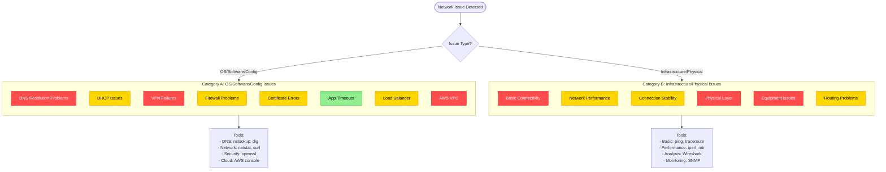

# Network Issues Reference Guide

## Table of Contents

- [Quick Reference](#quick-reference)
- [Issue Categories](#issue-categories)
  - [Category A: OS/Software/Configuration Issues](#category-a-ossoftwareconfiguration-issues)
  - [Category B: Infrastructure/Physical Issues](#category-b-infrastructure-physical-issues)
- [Network Issue Categories Diagram](#network-issue-categories-diagram)

## Quick Reference

| Severity | Response Time | Issue Types |
|----------|--------------|-------------|
| 🔴 Critical | < 30 mins | Complete outages, Security breaches |
| 🟡 High | < 2 hours | Performance degradation, Limited access |
| 🟢 Medium | < 4 hours | Non-critical services affected |
| ⚪ Low | < 8 hours | Minor issues, Workarounds available |

## Issue Categories

### Category A: OS/Software/Configuration Issues

| #   | Scenario                      | Symptoms                               | Common Root Causes                                                                                            | Troubleshooting Steps                                                                                                     | Key Tools/Commands                      |
| --- | ----------------------------- | -------------------------------------- | ------------------------------------------------------------------------------------------------------------- | ------------------------------------------------------------------------------------------------------------------------- | --------------------------------------- |
| 1   | 🔴 DNS Resolution Problems    | Cannot resolve hostnames               | • DNS server outage • Incorrect DNS settings • Corrupted DNS cache • DNS record issues               | 1. Test with IP directly 2. Check DNS settings 3. Flush DNS cache 4. Try alternate DNS                           | `nslookup`, `dig`, `ipconfig /flushdns` |
| 2   | 🟡 DHCP Not Assigning IPs     | "No IP configuration"                  | • DHCP server down • IP pool exhaustion • DHCP scope issues • Client configuration                   | 1. Try static IP temporarily 2. Restart DHCP service 3. Check DHCP logs 4. Verify IP pool                        | `ipconfig /release`, `ipconfig /renew`  |
| 3   | 🔴 VPN Connection Failures    | Cannot establish tunnel                | • Authentication issues • VPN service down • Connection blocking • Policy mismatches                 | 1. Check credentials 2. Verify server reachable 3. Check client logs 4. Review VPN configs                       | VPN client logs, `ping`, `traceroute`   |
| 4   | 🟡 Firewall Blocking Traffic  | Specific services unreachable          | • Restrictive policies • Default deny rules • Stateful inspection issues • Application filtering     | 1. Temporarily disable firewall 2. Check rule configurations 3. Test with specific ports 4. Review firewall logs | `telnet`, `nc`, firewall logs           |
| 5   | 🟡 SSL/TLS Certificate Errors | Browser security warnings              | • Expired certificates • Hostname mismatch • Untrusted CA • Revoked certificates                     | 1. Verify certificate validity 2. Check certificate chain 3. Confirm correct hostname 4. Review expiration date  | `openssl`, browser developer tools      |
| 6   | 🟢 Application Timeouts       | Services start but fail                | • Resource exhaustion • Backend latency • Connection limits • Improper timeout values                | 1. Check service status 2. Verify connectivity to backends 3. Review timeout settings 4. Monitor resource usage  | `netstat`, `curl`, application logs     |
| 7   | 🟡 Load Balancer Issues       | Uneven distribution                    | • Health check failures • Backend server issues • Sticky session problems • Algorithm misconfigs     | 1. Check health probe status 2. Verify backend health 3. Review LB configuration 4. Monitor traffic patterns     | LB logs, `curl`, backend metrics        |
| 8   | 🔴 AWS VPC Connectivity       | EC2 instances unreachable              | • Security group rules • Route table misconfigs • NACL blocking • IGW/NAT issues                     | 1. Check security groups 2. Verify route tables 3. Test IGW/NAT gateway 4. Review NACLs                          | VPC Flow Logs, Reachability Analyzer    |
| 9   | 🔴 NAT Gateway Problems       | Private instances can't reach internet | • NAT failure • Route table issues • Security group rules • EIP problems                             | 1. Check NAT status 2. Verify route tables 3. Test outbound rules 4. Confirm elastic IP                          | AWS console, VPC Flow Logs              |
| 10  | 🟢 Port Forwarding Failures   | External access blocked                | • Router misconfig • Double-NAT issues • Firewall blocking • ISP restrictions                        | 1. Verify router configuration 2. Check firewall rules 3. Test locally first 4. Confirm public IP                | `nc`, port scanning tools               |
| 11  | 🟡 BGP Peering Problems       | Routes not advertised                  | • ASN mismatches • Auth failures • Route policies blocking • Peer timeouts                           | 1. Verify BGP neighbor status 2. Check AS numbers 3. Review route policies 4. Confirm authentication             | `show ip bgp neighbors`, router logs    |
| 12  | ⚪ DNS Propagation Delay       | Recent changes not visible             | • High TTL values • Caching at multiple levels • DNS server replication • Anycast routing            | 1. Check TTL values 2. Verify with multiple resolvers 3. Force cache flush 4. Wait for propagation               | `dig +trace`, DNS lookup tools          |
| 13  | 🟢 QoS Configuration Issues   | Prioritized traffic delayed            | • Mismarked traffic • Queue config errors • Bandwidth allocation • Policy mismatches                 | 1. Check QoS policies 2. Test traffic marking 3. Review queuing configuration 4. Monitor priority queues         | QoS monitoring, packet analyzers        |
| 14  | 🟡 Proxy Server Problems      | Web access selective failures          | • Proxy overload • Configuration errors • Cache corruption • Authentication issues                   | 1. Bypass proxy temporarily 2. Check proxy logs 3. Review proxy settings 4. Test direct connection               | Proxy logs, browser network tools       |
| 15  | 🔴 DNS Rebinding              | Security blocks                        | • Security policy blocks • Same-origin policy • Reverse DNS mismatches • Hostname validation         | 1. Check DNS security policies 2. Review browser security 3. Check local hosts file 4. Update security software  | DNS logs, security settings             |
| 16  | 🟡 Transit Gateway Problems   | Cross-VPC access failures              | • TGW attachment issues • Route propagation • Multiple route tables • Security group incompatibility | 1. Check TGW route tables 2. Verify attachments 3. Review security groups 4. Test direct peering                 | TGW Network Manager, VPC Flow Logs      |

### Category B: Infrastructure/Physical Issues

| # | Scenario | Symptoms | Common Root Causes | Troubleshooting Steps | Key Tools/Commands |
|---|----------|----------|-------------------|---------------------|-------------------|
| 1 | 🔴 Basic Connectivity Failure | Cannot reach resources | • Cable/hardware failures • IP misconfiguration • Default gateway issues • Network interface down | 1. Check physical connections 2. Verify IP configuration 3. Test local network 4. Check gateway | `ping`, `ipconfig/ifconfig`, `route print` |
| 2 | 🟡 Slow Network Performance | High latency, timeouts | • Network congestion • Bandwidth limitations • Hardware bottlenecks • QoS issues | 1. Check bandwidth usage 2. Run speed test 3. Test with minimal traffic 4. Check for packet loss | `speedtest-cli`, `iperf`, `mtr` |
| 3 | 🟡 Intermittent Connection | Random disconnects | • Interference • Hardware instability • Driver issues • Power fluctuations | 1. Monitor connection over time 2. Check for interference 3. Review logs 4. Replace cables/equipment | `ping -t`, network monitoring tools |
| 4 | 🟢 Wi-Fi Connection Issues | Poor wireless signal | • Interference • Distance limitations • Channel congestion • Outdated firmware | 1. Check signal strength 2. Change Wi-Fi channel 3. Relocate access point 4. Update firmware | Wi-Fi analyzer, router admin console |
| 5 | 🟡 Packet Loss | Degraded performance | • Congestion • Hardware errors • Buffer overflows • Misconfigurations | 1. Check route quality 2. Identify bottlenecks 3. Test different paths 4. Check for physical issues | `mtr`, `pathping`, `tcpping` |
| 6 | 🟢 IP Address Conflicts | Duplicate IP detected | • Static IP misconfiguration • DHCP overlap • Rogue DHCP servers • Subnet mask issues | 1. Identify conflicting devices 2. Check DHCP reservations 3. Use static IPs 4. Segment network | `arp -a`, network scanner |
| 7 | 🟢 High Bandwidth Usage | Network congestion | • Video streaming • Backup processes • Malware/unwanted traffic • P2P applications | 1. Identify top talkers 2. Monitor traffic patterns 3. Implement QoS 4. Segment traffic | NetFlow, packet analyzers |
| 8 | 🔴 Routing Loops | Extremely high latency | • Bad route redistribution • Missing null routes • Duplicate subnets • Misconfigured OSPF/BGP | 1. Trace packet path 2. Check routing tables 3. Review router configs 4. Test with static routes | `traceroute`, router logs |
| 9 | 🔴 Spanning Tree Issues | Network instability | • Physical loops • STP misconfig • Bridge priority issues • BPDU problems | 1. Check for loops 2. Verify STP configuration 3. Review switch logs 4. Trace cable paths | Switch logs, topology maps |
| 10 | 🟡 MTU Fragmentation | Large packets dropped | • Path MTU discovery fails • VPN/tunnel overhead • Jumbo frames issues • Device misconfigs | 1. Test with varied packet sizes 2. Check MTU settings 3. Adjust MTU on devices 4. Test path MTU discovery | `ping -f -l size`, MTU testing tools |
| 11 | 🔴 Direct Connect Issues | AWS private link down | • Circuit problems • Provider issues • BGP misconfig • VLAN tagging errors | 1. Check BGP status 2. Verify physical cross-connects 3. Confirm VLAN tagging 4. Test with public connections | AWS DC logs, BGP neighbor status |
| 12 | 🟢 IPv6 Connectivity Issues | Dual-stack failures | • IPv6 not supported • Router advertisement issues • DNS AAAA missing • Application compatibility | 1. Test IPv4 only 2. Check IPv6 configuration 3. Verify router advertisements 4. Check DNS AAAA records | `ping6`, `tracert6`, `ipconfig` |
| 13 | 🟡 Multicast Routing Failures | Streaming/video issues | • PIM configuration • IGMP filtering • Multicast scope • Layer 2 issues | 1. Verify IGMP configuration 2. Check multicast routing 3. Test with unicast 4. Review PIM settings | `ping -t 224.x.x.x`, multicast tools |
| 14 | 🔴 Network Equipment Failure | Complete outage | • Hardware failure • Power issues • Software crashes • Configuration corruption | 1. Check power/connectivity 2. Review system logs 3. Test redundant paths 4. Replace hardware | SNMP monitoring, equipment diagnostics |

## Network Issue Categories Diagram

> Note: This guide provides a structured approach to diagnosing and resolving common network issues. The severity indicators (🔴 Critical, 🟡 High, 🟢 Medium, ⚪ Low) help prioritize response times and resource allocation.
