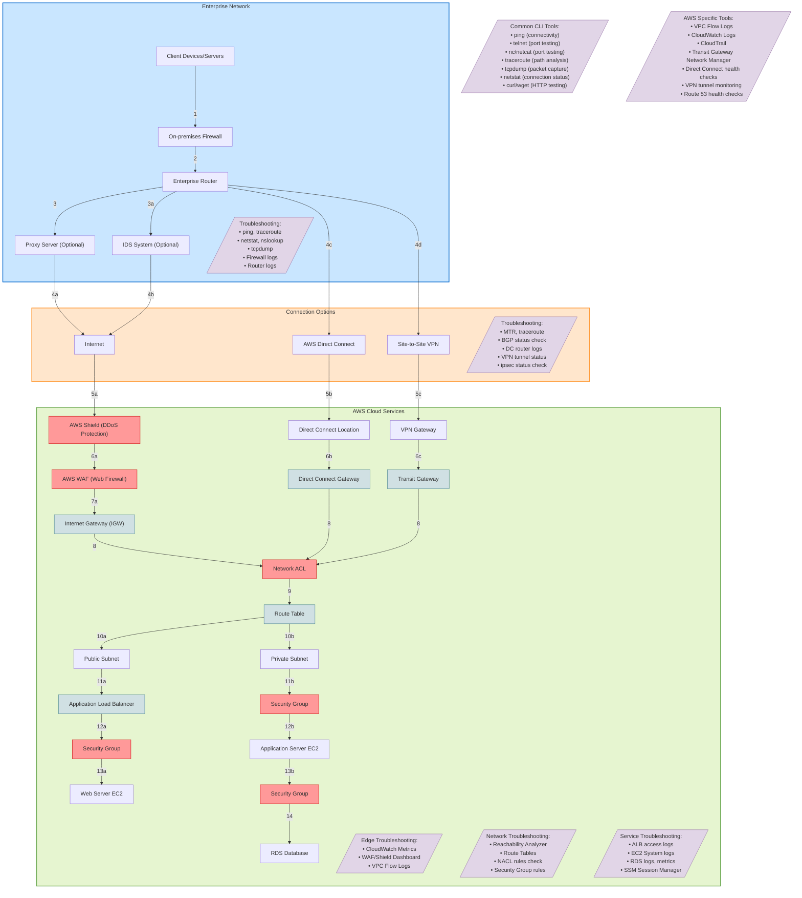

```mermaid
flowchart TD
    %% Enterprise Network Area
    subgraph Enterprise["Enterprise Network"]
        Client["Client Devices/Servers"] --> |1| LF["On-premises Firewall"]
        LF --> |2| Router["Enterprise Router"]
        Router --> |3| Proxy["Proxy Server (Optional)"]
        Router --> |3a| IDS["IDS System (Optional)"]
        
        %% Troubleshooting Tools - Enterprise
        TroubleE[/"Troubleshooting:
        • ping, traceroute
        • netstat, nslookup
        • tcpdump
        • Firewall logs
        • Router logs"/]
    end
    
    %% Connection Options Area
    subgraph ConnectionOptions["Connection Options"]
        Proxy --> |4a| Internet["Internet"]
        IDS --> |4b| Internet
        Router --> |4c| DirectConnect["AWS Direct Connect"]
        Router --> |4d| IPSEC["Site-to-Site VPN"]
        
        %% Troubleshooting Tools - Connection
        TroubleC[/"Troubleshooting:
        • MTR, traceroute
        • BGP status check
        • DC router logs
        • VPN tunnel status
        • ipsec status check"/]
    end
    
    %% AWS Cloud Services Area
    subgraph AWS["AWS Cloud Services"]
        %% Internet Connection Path
        Internet --> |5a| Shield["AWS Shield (DDoS Protection)"]
        Shield --> |6a| WAF["AWS WAF (Web Firewall)"]
        WAF --> |7a| IGW["Internet Gateway (IGW)"]
        
        %% Direct Connect Path
        DirectConnect --> |5b| DX["Direct Connect Location"]
        DX --> |6b| DXGW["Direct Connect Gateway"]
        
        %% VPN Connection Path
        IPSEC --> |5c| VPNGW["VPN Gateway"]
        VPNGW --> |6c| TGW["Transit Gateway"]
        
        %% VPC Network
        IGW --> |8| NACL["Network ACL"]
        DXGW --> |8| NACL
        TGW --> |8| NACL
        
        NACL --> |9| RouteTable["Route Table"]
        RouteTable --> |10a| PublicSubnet["Public Subnet"]
        RouteTable --> |10b| PrivateSubnet["Private Subnet"]
        
        %% Public Subnet
        PublicSubnet --> |11a| ALB["Application Load Balancer"]
        ALB --> |12a| SG1["Security Group"]
        SG1 --> |13a| EC2Web["Web Server EC2"]
        
        %% Private Subnet
        PrivateSubnet --> |11b| SG2["Security Group"]
        SG2 --> |12b| EC2App["Application Server EC2"]
        EC2App --> |13b| SG3["Security Group"]
        SG3 --> |14| RDS["RDS Database"]
        
        %% AWS Troubleshooting Tools
        TroubleA1[/"Edge Troubleshooting:
        • CloudWatch Metrics
        • WAF/Shield Dashboard
        • VPC Flow Logs"/]
        
        TroubleA2[/"Network Troubleshooting:
        • Reachability Analyzer
        • Route Tables
        • NACL rules check
        • Security Group rules"/]
        
        TroubleA3[/"Service Troubleshooting:
        • ALB access logs
        • EC2 System logs
        • RDS logs, metrics
        • SSM Session Manager"/]
    end
    
    %% Command Line Tools
    CommandLine[/"Common CLI Tools:
    • ping (connectivity)
    • telnet (port testing)
    • nc/netcat (port testing)
    • traceroute (path analysis)
    • tcpdump (packet capture)
    • netstat (connection status)
    • curl/wget (HTTP testing)"/]
    
    %% AWS Specific Tools
    AWSTools[/"AWS Specific Tools:
    • VPC Flow Logs
    • CloudWatch Logs
    • CloudTrail
    • Transit Gateway Network Manager
    • Direct Connect health checks
    • VPN tunnel monitoring
    • Route 53 health checks"/]
    
    %% Style Settings
    classDef enterprise fill:#c9e6ff,stroke:#0066cc,stroke-width:2px;
    classDef connection fill:#ffe6cc,stroke:#ff9933,stroke-width:2px;
    classDef aws fill:#e6f5d0,stroke:#6aa84f,stroke-width:2px;
    classDef security fill:#ff9999,stroke:#cc0000,stroke-width:1px;
    classDef networking fill:#d0e0e3,stroke:#45818e,stroke-width:1px;
    classDef tools fill:#e1d5e7,stroke:#9673a6,stroke-width:1px;
    
    class Enterprise enterprise;
    class ConnectionOptions connection;
    class AWS aws;
    class Shield,WAF,NACL,SG1,SG2,SG3 security;
    class IGW,DXGW,TGW,RouteTable,ALB networking;
    class TroubleE,TroubleC,TroubleA1,TroubleA2,TroubleA3,CommandLine,AWSTools tools;
```
