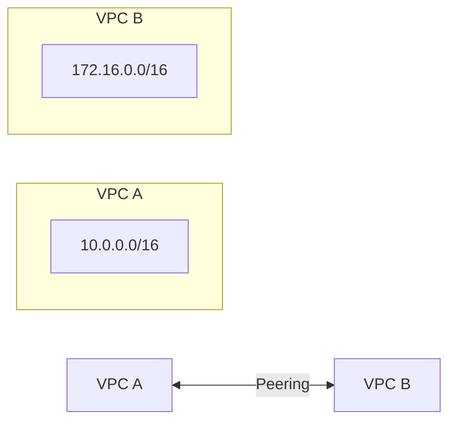

# AWS VPC Quick Reference 🌐

## VPC Components 📦

| Component | Description | Limit per Region |
|-----------|-------------|------------------|
| VPC | Isolated network | 5 per region |
| Subnet | Network segment | 200 per VPC |
| Route Table | Traffic rules | 200 per VPC |
| NACL | Stateless firewall | 200 per VPC |
| Security Group | Stateful firewall | 500 per VPC |
| Internet Gateway | Internet access | 1 per VPC |
| NAT Gateway | Private subnet internet | 1 per AZ |

## CIDR Blocks 📋

| Network Size | CIDR Block | Available IPs |
|-------------|------------|---------------|
| Small | /24 | 251 usable |
| Medium | /20 | 4,091 usable |
| Large | /16 | 65,531 usable |

> Note: AWS reserves 5 IPs in each subnet

## Security Groups vs NACLs 🛡️

| Feature      | Security Group | NACL              |
| ------------ | -------------- | ----------------- |
| Scope        | Instance level | Subnet level      |
| Rules        | Allow only     | Allow & Deny      |
| State        | Stateful       | Stateless         |
| Rule Process | All rules      | Rule number order |
| Default      | Allow nothing  | Allow everything  |

## Essential Commands 🛠️

```bash
# Create VPC
aws ec2 create-vpc --cidr-block 10.0.0.0/16

# Create Subnet
aws ec2 create-subnet --vpc-id vpc-123 --cidr-block 10.0.1.0/24

# Create Internet Gateway
aws ec2 create-internet-gateway
aws ec2 attach-internet-gateway --vpc-id vpc-123 --internet-gateway-id igw-123
```

## Best Practices ⭐

1. **Subnet Design**
   - Public: 10.0.1.0/24, 10.0.2.0/24
   - Private: 10.0.3.0/24, 10.0.4.0/24
   - DB: 10.0.5.0/24, 10.0.6.0/24

2. **Availability Zones**
   - Minimum 2 AZs for high availability
   - Spread subnets across AZs

3. **Security**
   - Use Security Groups as primary defense
   - NACLs for additional subnet protection
   - Least privilege principle

## Common Issues & Solutions 🔧

| Issue | Check | Solution |
|-------|-------|----------|
| No Internet | Route Table | Add IGW route |
| Can't Connect | Security Group | Check inbound rules |
| Subnet Full | CIDR | Expand or add subnet |
| NAT Issues | NAT Gateway | Check EIP and routes |

## VPC Peering ⚡



Key Points:

- No transitive peering
- No overlapping CIDR blocks
- Update route tables both sides

See [[AWS Networking]] for more details

## Network Architecture Diagram 🗺️

![[02-Assets/Attachments/AWS_network.png|AWS Network Architecture]]

## AWS Networking Services Summary 🌐

| Service         | Primary Networking Role                |
| --------------- | -------------------------------------- |
| VPC             | Isolated network environment           |
| IGW             | Internet access for public subnets     |
| ELB (ALB/NLB)   | Traffic distribution                   |
| Route 53        | DNS management and routing             |
| CloudFront      | Global content delivery (CDN)          |
| PrivateLink     | Private service access                 |
| Transit Gateway | Multi-VPC/on-premises connectivity hub |
| VPC Peering     | Direct VPC-to-VPC connectivity         |
| Client VPN      | Remote user access                     |
| Direct Connect  | Dedicated private network link         |
| IPSec VPN       | Secure internet-based VPN tunnel       |
| VPC Endpoints   | Private access to AWS services         |
| NAT Gateway     | Outbound internet for private subnets  |

## Detailed Networking Services Explanation 📚

### Core Network Services

#### 1. VPC (Virtual Private Cloud) 🏢

- **Primary Function**: Isolated virtual network
- **Key Components**:
  - Public/Private Subnets
  - Route Tables
  - NAT Gateway
- **Use Cases**: Resource isolation, network segmentation

#### 2. Internet Gateway & NAT 🌐

- **IGW**: Public subnet internet access
- **NAT Gateway**:
  - Private subnet outbound traffic
  - No inbound connections
  - High availability per AZ

#### 3. Load Balancing ⚖️

- **Application Load Balancer (ALB)**
  - Layer 7 (HTTP/HTTPS)
  - Path-based routing
  - Host-based routing
- **Network Load Balancer (NLB)**
  - Layer 4 (TCP/UDP)
  - Ultra-low latency
  - Static IP support

### Advanced Connectivity Services

#### 1. Hybrid Connections 🔄

- **Direct Connect**
  - Dedicated private connection
  - Consistent network performance
  - Reduced bandwidth costs
- **Site-to-Site VPN**
  - Encrypted IPSec tunnels
  - Public internet based
  - Quick to set up

#### 2. Inter-VPC Communication 🤝

- **VPC Peering**
  - Direct VPC-to-VPC connection
  - No transit gateway needed
  - Regional or cross-region
- **Transit Gateway**
  - Hub-and-spoke model
  - Simplified routing
  - Centralized management

### Security & Access Services

#### 1. Private Access 🔒

- **VPC Endpoints**
  - Gateway Endpoints (S3/DynamoDB)
  - Interface Endpoints (Other AWS services)
  - No internet exposure
- **PrivateLink**
  - Service access without internet
  - Cross-account support
  - Service provider model

#### 2. Remote Access 🔑

- **Client VPN**
  - OpenVPN-based solution
  - Per-user access control
  - Split-tunnel support

### Global Network Services

#### 1. Route 53 🌍

- **DNS Management**
  - Global DNS service
  - Health checking
  - Multiple routing policies
- **Traffic Management**
  - Latency-based routing
  - Geolocation routing
  - Weighted round robin

#### 2. CloudFront 🚀

- **Content Delivery**
  - Global edge locations
  - Cache static/dynamic content
  - HTTPS support
- **Security Features**
  - DDoS protection
  - SSL/TLS encryption
  - Field-level encryption

For implementation examples, see [[AWS Network Examples]]
