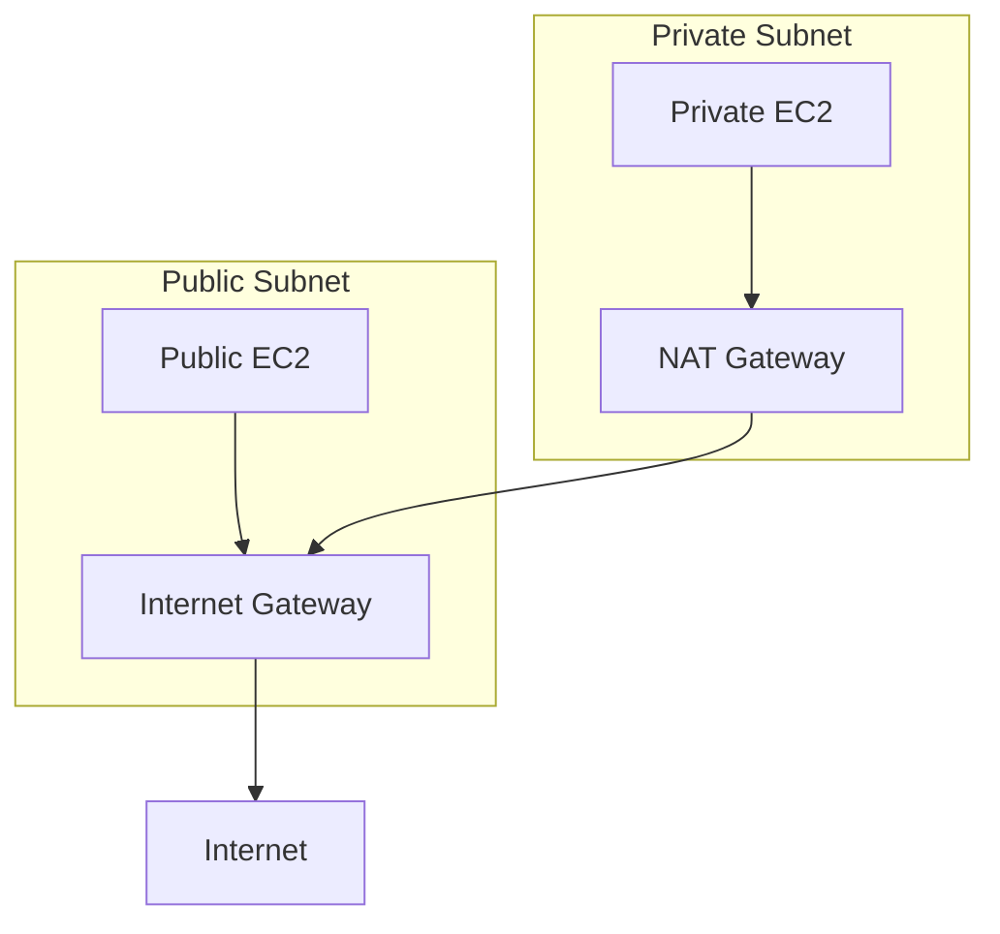
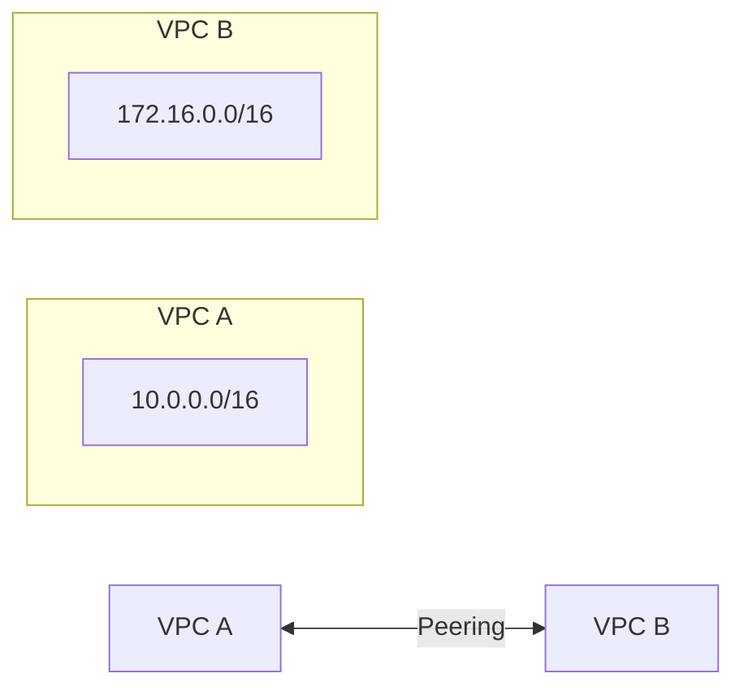

# AWS VPC Quick Reference 🌐

## VPC Components 📦

| Component | Description | Limit per Region |
|-----------|-------------|------------------|
| VPC | Isolated network | 5 per region |
| Subnet | Network segment | 200 per VPC |
| Route Table | Traffic rules | 200 per VPC |
| NACL | Stateless firewall | 200 per VPC |
| Security Group | Stateful firewall | 500 per VPC |
| Internet Gateway | Internet access | 1 per VPC |
| NAT Gateway | Private subnet internet | 1 per AZ |

## CIDR Blocks 📋

| Network Size | CIDR Block | Available IPs |
|-------------|------------|---------------|
| Small | /24 | 251 usable |
| Medium | /20 | 4,091 usable |
| Large | /16 | 65,531 usable |

> Note: AWS reserves 5 IPs in each subnet

## Security Groups vs NACLs 🛡️

| Feature      | Security Group | NACL              |
| ------------ | -------------- | ----------------- |
| Scope        | Instance level | Subnet level      |
| Rules        | Allow only     | Allow & Deny      |
| State        | Stateful       | Stateless         |
| Rule Process | All rules      | Rule number order |
| Default      | Allow nothing  | Allow everything  |

## Common Architecture 🏗️



## Essential Commands 🛠️

```bash
# Create VPC
aws ec2 create-vpc --cidr-block 10.0.0.0/16

# Create Subnet
aws ec2 create-subnet --vpc-id vpc-123 --cidr-block 10.0.1.0/24

# Create Internet Gateway
aws ec2 create-internet-gateway
aws ec2 attach-internet-gateway --vpc-id vpc-123 --internet-gateway-id igw-123
```

## Best Practices ⭐

1. **Subnet Design**
   - Public: 10.0.1.0/24, 10.0.2.0/24
   - Private: 10.0.3.0/24, 10.0.4.0/24
   - DB: 10.0.5.0/24, 10.0.6.0/24

2. **Availability Zones**
   - Minimum 2 AZs for high availability
   - Spread subnets across AZs

3. **Security**
   - Use Security Groups as primary defense
   - NACLs for additional subnet protection
   - Least privilege principle

## Common Issues & Solutions 🔧

| Issue | Check | Solution |
|-------|-------|----------|
| No Internet | Route Table | Add IGW route |
| Can't Connect | Security Group | Check inbound rules |
| Subnet Full | CIDR | Expand or add subnet |
| NAT Issues | NAT Gateway | Check EIP and routes |

## VPC Peering ⚡



Key Points:

- No transitive peering
- No overlapping CIDR blocks
- Update route tables both sides

See [[AWS Networking]] for more details
