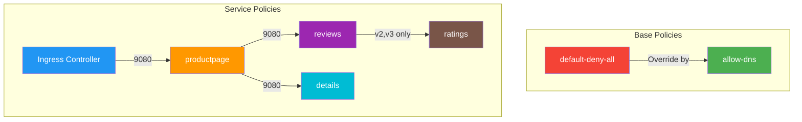
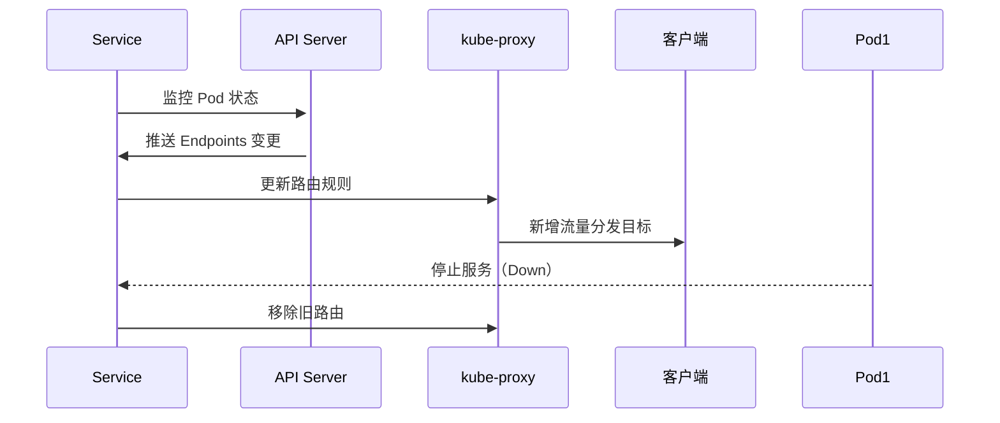

# Calico

## Network Policy
https://docs.tigera.io/calico/latest/about/kubernetes-training/about-network-policy

### Kubernetes network policy
### ## Calico network policy[​](https://docs.tigera.io/calico/latest/about/kubernetes-training/about-network-policy#calico-network-policy)
 One of the most common approaches is to have a small number of global policies that apply to all pods, and then a single pod specific policy that defines all the ingress and egress rules that are particular to that pod.
## Best practices for network policies
Small flaw for this example:
metadata:  
name: back-end  
namespace: staging

![[Calico-RBAC-example-tiers-350db070cf4f095db5de19ecbcc1e9ea.svg|1750]]Key notes:
- External database resource: NLB, FQDN
- Deny all and allow dns globally, and then apply RBAC, granular control

![[Drawing 2025-03-21 19.02.12.excalidraw|1248]]


# Bookinfo Network Policies

  

This directory contains Calico Network Policies for the Bookinfo application, implementing a zero-trust security model.

  

## Directory Structure

  

```

.

├── base/

│   ├── 00-default-deny.yaml    # Default deny all traffic

│   └── 01-allow-dns.yaml       # Allow DNS resolution

└── services/

    ├── productpage/

    │   ├── ingress.yaml        # Allow traffic from ingress-nginx

    │   └── egress.yaml         # Allow traffic to reviews and details

    ├── reviews/

    │   ├── ingress.yaml        # Allow traffic from productpage

    │   └── egress.yaml         # Allow v2/v3 traffic to ratings

    ├── details/

    │   └── ingress.yaml        # Allow traffic from productpage

    └── ratings/

        └── ingress.yaml        # Allow traffic from reviews v2/v3

```

  

## Policy Overview

  



  

## Policy Details

  

### Base Policies

- **default-deny-all**: Implements zero-trust model by denying all traffic by default

- **allow-dns**: Enables DNS resolution for all pods

  

### Service-specific Policies

  

#### Productpage Service

- **Ingress**: Allows traffic from ingress-nginx controller

- **Egress**: Permits connections to reviews and details services

  

#### Reviews Service

- **Ingress**: Accepts traffic from productpage

- **Egress**: Allows v2/v3 versions to connect to ratings service

  

#### Details Service

- **Ingress**: Accepts traffic from productpage only

  

#### Ratings Service

- **Ingress**: Accepts traffic from reviews service (v2/v3 only)

  

## Policy Order

  

1. Base policies (900-1000)

   - default-deny-all (1000)

   - allow-dns (900)

2. Service policies (100-500)

   - productpage ingress (100)

   - productpage egress (200)

   - reviews/details ingress (300)

   - reviews egress (400)

   - ratings ingress (500)

  

## Testing Guide

  

### Command Usage

```bash

# tc command usage:

# Connect to pod:        tc <pod-prefix>

# Check connectivity:    tc <pod-prefix> <service-name-or-ip> <port>

```

  

### 1. Pre-Test Validation

```bash

# Verify all pods are running

kubectl get pods -n dev1 -o wide

  

# Verify initial connectivity

tc alpine-test productpage 9080     # Should return HTTP 200

tc productpage reviews 9080     # Should succeed

tc productpage details 9080     # Should succeed

tc reviews-v2 ratings 9080      # Should succeed

tc alpine-test 10.96.0.10 53 # Should succeed

```

  

### 2. Base Policy Implementation

```bash

# Apply default deny all policy

calicoctl apply -f base/00-default-deny.yaml

# revoke
# calicoctl delete networkpolicy -n dev1 default.default-deny-all

# Test DNS blocking (should fail)

tc alpine-test 10.96.0.10 53

  

# Apply DNS policy

calicoctl apply -f base/01-allow-dns.yaml

  

# Verify policy status

calicoctl get networkpolicy -n dev1

  

# Verify DNS working but other traffic blocked

tc alpine-test 10.96.0.10 53      # Should succeed

tc alpine-test productpage 9080   # Should timeout

tc productpage reviews 9080       # Should timeout

```

  

### 3. Service Policy Testing

  

#### a. Productpage Access

```bash

# Apply productpage policies

calicoctl apply -f services/productpage/

calicoctl get networkpolicy -n dev1 allow-ingress-to-productpage -o yaml

  

# Verify connectivity
kubectl exec -it ingress-nginx-controller-996745659-6s6sc -n ingress-nginx -- /bin/bash
tc ingress-nginx productpage 9080          
nc -zv productpage.dev1.svc 9080 # Should return 200

tc productpage reviews 9080         # Should timeout

tc productpage details 9080         # Should timeout

```

  

#### b. Reviews Service

```bash

# Apply reviews policy

calicoctl apply -f services/reviews/

calicoctl get networkpolicy -n dev1
  

# Verify connectivity

tc productpage reviews 9080         # Should succeed

tc reviews-v1 ratings 9080          # Should timeout

tc reviews-v2 ratings 9080          # Should timeout

can connect to pod port, but not cluster ip port....

```

  

#### c. Details Service

```bash

# Apply details policy

calicoctl apply -f services/details/

  

# Test connectivity

tc productpage details 9080         # Should succeed

tc reviews-v1 details 9080         # Should timeout

```

  

#### d. Ratings Service

```bash

# Apply ratings policy

calicoctl apply -f services/ratings/

  

# Validate least privilege access

tc reviews-v2 ratings 9080          # Should succeed

tc reviews-v1 ratings 9080          # Should timeout

```

  

### 4. Verification Matrix

  

| Source | Destination | Port | Expected |

|--------|-------------|------|----------|

| ingress-controller | productpage | 9080 | ALLOW |

| productpage | reviews | 9080 | ALLOW |

| productpage | details | 9080 | ALLOW |

| reviews-v2/v3 | ratings | 9080 | ALLOW |

| reviews-v1 | ratings | 9080 | DENY |

| alpine-test | any service | any | DENY |

  

### 5. Troubleshooting

  

#### Policy Verification

```bash
 kgp -n dev1 -o wide
 
 k exec -n dev1 -it productpage-v1-66c4dc5d5c-lzwxr -- /bin/bash
# Check policy hit counters

calicoctl get networkpolicy -n dev1 -o yaml | grep -E "name|rulesApplied"

  

# Verify BGP routes

calicoctl node status

  

# Check denied connections

kubectl logs -n kube-system -l k8s-app=calico-node -c calico-node | grep DROP

```

  

#### Connectivity Debugging

```bash

# Test service resolution

tc <source-pod> <destination-service> 9080

  

# Check pod labels

kubectl get pods -n dev1 --show-labels

  

# Verify policy details

calicoctl get networkpolicy -n dev1 <policy-name> -o yaml
```


### Service policy in Calico
https://docs.tigera.io/calico/latest/network-policy/policy-rules/service-policy
https://docs.tigera.io/calico/latest/network-policy/get-started/calico-policy/calico-network-policy





description of hard issue.
1. in productpage pod, nc -zv reviews.dev1.svc 9080 opened. nc -zv details.dev1.svc 9080 timeout.
2. in productpage pod, nslookup details.dev1.svc  resolve cluster IP.
3. in productpage pod, nc -zv details_service_cluster_IP 9080 timeout, nc -zv details_endpoint 9080, opened.
4. Apply allow all rule with order=1 with calicoctl, nc -zv details.dev1.svc 9080 opened.
5. compared productpage egress networkpolicy, reviews and details are the same.
6. Compared details and reviews, ingress networkpolicy, they are the same.

I noticed reviews cluster ip is 10.111.x.x
Fixed the issue by reconfigure the "clusterCIDR: 10.122.0.0/16" beca
kubectl edit cm kube-proxy -n kube-system

restart kube-proxy pod:
kubectl delete pods -n kube-system -l k8s-app=kube-proxy


## install calicoctl
  311  curl -L https://github.com/projectcalico/calico/releases/download/v3.29.2/calicoctl-linux-amd64 -o calicoctl
  312  chmod +x calicoctl
  313  sudo mv calicoctl /usr/local/bin/
  314  calicoctl version

## show BGP
tibco@k8s-node1:~$ sudo calicoctl node status
Calico process is running.

IPv4 BGP status
+----------------+-------------------+-------+----------+-------------+
|  PEER ADDRESS  |     PEER TYPE     | STATE |  SINCE   |    INFO     |
+----------------+-------------------+-------+----------+-------------+
| 192.168.10.100 | node-to-node mesh | up    | 04:19:02 | Established |
| 192.168.10.102 | node-to-node mesh | up    | 04:19:09 | Established |
+----------------+-------------------+-------+----------+-------------+

tibco@k8s-node1:~$ sudo birdc show status
BIRD 2.0.8 ready.
BIRD 2.0.8
Router ID is 10.122.36.64
Hostname is k8s-node1
Current server time is 2025-03-23 17:00:00.748
Last reboot on 2025-03-23 16:59:53.415
Last reconfiguration on 2025-03-23 16:59:53.415
Daemon is up and running


tibco@k8s-node1:~$ ip route show
default via 192.168.10.2 dev ens33 proto static
blackhole 10.122.36.64/26 proto bird
10.122.36.69 dev cali08440ddce5b scope link
10.122.36.70 dev cali0ea970dc3e2 scope link
10.122.36.71 dev cali711c5340b4d scope link
10.122.36.72 dev cali3e3316659a6 scope link
10.122.62.128/26 via 192.168.10.100 dev tunl0 proto bird onlink
10.122.169.128/26 via 192.168.10.102 dev tunl0 proto bird onlink
172.17.0.0/16 dev docker0 proto kernel scope link src 172.17.0.1 linkdown
192.168.10.0/24 dev ens33 proto kernel scope link src 192.168.10.101


tibco@k8s-cp:~$ kgs -n dev1 -o wide
NAME          TYPE        CLUSTER-IP       EXTERNAL-IP   PORT(S)    AGE     SELECTOR
details       ClusterIP   10.104.97.21     <none>        9080/TCP   5d11h   app=details
productpage   ClusterIP   10.108.145.154   <none>        9080/TCP   5d11h   app=productpage
ratings       ClusterIP   10.111.155.22    <none>        9080/TCP   5d11h   app=ratings
reviews       ClusterIP   10.98.92.226     <none>        9080/TCP   5d11h   app=reviews

tibco@k8s-cp:~$ kge -n dev1 -o wide
NAME          ENDPOINTS                                                 AGE
details       10.122.36.69:9080                                         5d11h
productpage   10.122.169.134:9080                                       5d11h
ratings       10.122.169.133:9080                                       5d11h
reviews       10.122.169.135:9080,10.122.36.70:9080,10.122.36.72:9080   5d11h

