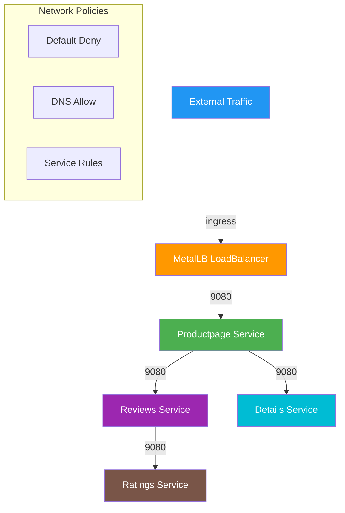

# Kubernetes Cluster Implementation with Network Policies

## Technical Documentation

  

### Environment Overview

- **Infrastructure**: VMware with 3 Ubuntu 22.04.5 LTS servers

- **Network Configuration**:

  - k8s-cp: 192.168.10.100

  - k8s-node1: 192.168.10.101

  - k8s-node2: 192.168.10.102

  

## 1. Base System Configuration

  

### 1.1 Package Management Setup

```bash

# Fix GPG key format issue

sudo rm /etc/apt/trusted.gpg.d/kubernetes-archive-keyring.gpg

curl -fsSL https://pkgs.k8s.io/core:/stable:/v1.30/deb/Release.key | sudo gpg --dearmor -o /usr/share/keyrings/kubernetes-apt-keyring.gpg

  

# Configure repository

echo "deb [signed-by=/usr/share/keyrings/kubernetes-apt-keyring.gpg] https://pkgs.k8s.io/core:/stable:/v1.30/deb/ /" | sudo tee /etc/apt/sources.list.d/kubernetes.list

  

# Clean and update

sudo rm -rf /var/lib/apt/lists/*

sudo apt clean

sudo apt update

```

  

### 1.2 Time Synchronization

```bash

sudo apt install -y chrony

sudo systemctl enable --now chrony

```

  

## 2. Kubernetes Setup

  

### 2.1 Control Plane Initialization

```bash

# Initialize control plane

sudo kubeadm init \

  --pod-network-cidr=10.111.0.0/16 \

  --apiserver-advertise-address=192.168.10.100

  

# Configure kubectl

mkdir -p $HOME/.kube

sudo cp -i /etc/kubernetes/admin.conf $HOME/.kube/config

sudo chown $(id -u):$(id -g) $HOME/.kube/config

```

  

### 2.2 Worker Node Join

```bash

sudo kubeadm join 192.168.10.100:6443 --token <token> \

        --discovery-token-ca-cert-hash <hash>

```

  

## 3. Network Configuration

  

### 3.1 Calico CNI Installation

```bash

# Download and modify Calico manifest

curl -O https://raw.githubusercontent.com/projectcalico/calico/v3.26.1/manifests/calico.yaml

  

# Deploy Calico

kubectl apply -f calico.yaml

```

  

### 3.2 MetalLB Installation

```bash

# Install MetalLB

kubectl apply -f https://raw.githubusercontent.com/metallb/metallb/main/config/manifests/metallb-native.yaml

  

# Configure IP pool

cat << EOF > metallb-config.yaml

apiVersion: metallb.io/v1beta1

kind: IPAddressPool

metadata:

  name: production-public-ips

  namespace: metallb-system

spec:

  addresses:

  - 192.168.10.110-192.168.10.120

EOF

  

kubectl apply -f metallb-config.yaml

```

  

## 4. Application Deployment

  

### 4.1 Namespace Creation

```bash

kubectl create namespace dev1

```

  

### 4.2 Application Deployment

```bash

kubectl apply -f bookinfo.yaml -n dev1

```

  

### 4.3 Testing Pod Setup

```bash

# Create Alpine pod

kubectl run test-alpine --image=alpine --restart=Never -- sleep infinity

  

# Create Alpine deployment

cat << EOF > alpine-deployment.yaml

apiVersion: apps/v1

kind: Deployment

metadata:

  name: alpine-test

  namespace: dev1

spec:

  replicas: 1

  selector:

    matchLabels:

      app: alpine-test

  template:

    metadata:

      labels:

        app: alpine-test

    spec:

      containers:

      - name: alpine

        image: alpine

        command: ["sleep", "infinity"]

EOF

  

kubectl apply -f alpine-deployment.yaml

```

  

### 4.4 Install Testing Tools in Alpine Pod

```bash

# Access the alpine pod

kubectl exec -it $(kubectl get pods -n dev1 -l app=alpine-test -o jsonpath='{.items[0].metadata.name}') -n dev1 -- /bin/sh

  

# Install required packages

apk update

apk add --no-cache \

  bind-tools \  # For DNS tools like dig, nslookup

  curl \        # For HTTP requests

  netcat-openbsd \ # For network testing

  iputils      # For ping and network utilities

```

  

### 4.5 Service Validation

```bash

# Test connectivity to each service

curl http://productpage:9080

curl http://details:9080

curl http://ratings:9080

curl http://reviews:9080

  

# DNS resolution test

nslookup productpage.dev1.svc.cluster.local

nslookup details.dev1.svc.cluster.local

nslookup ratings.dev1.svc.cluster.local

nslookup reviews.dev1.svc.cluster.local

  

# Network connectivity test

nc -zv productpage.dev1.svc 9080

nc -zv details.dev1.svc 9080

nc -zv ratings.dev1.svc 9080

nc -zv reviews.dev1.svc 9080

# For convinience, created a test script tc and added into bashrc
Usage:
  Connect to pod:        tc <pod-prefix>
  Check port connectivity: tc <pod-prefix> <service-name-or-ip> <port>tc

```

### 4.6 Upgrade Calico(uninstall/reinstall)

**Switch pod CIDR from 10.111.0.0/16 to 10.122.0.0/16 in calico configuration.(This cause issue later)**

  

## 5. Network Policy Implementation

  

### 5.1 Base Policies

```yaml

# 00-default-deny.yaml

apiVersion: projectcalico.org/v3

kind: NetworkPolicy

metadata:

  name: default-deny-all

  namespace: dev1

spec:

  order: 1000

  selector: all()

  types:

  - Ingress

  - Egress

  

# 01-allow-dns.yaml

apiVersion: projectcalico.org/v3

kind: NetworkPolicy

metadata:

  name: allow-dns

  namespace: dev1

spec:

  order: 900

  selector: all()

  egress:

  - action: Allow

    protocol: UDP

    destination:

      selector: k8s-app == 'kube-dns'

      ports: [53]

  types:

  - Egress

```

  

### 5.2 Service-Specific Policies

```yaml

# productpage-ingress.yaml

apiVersion: projectcalico.org/v3

kind: NetworkPolicy

metadata:

  name: allow-ingress-to-productpage

  namespace: dev1

spec:

  order: 100

  selector: app == 'productpage'

  ingress:

  - action: Allow

    protocol: TCP

    destination:

      ports: [9080]

  types:

  - Ingress

  

# productpage-egress.yaml

apiVersion: projectcalico.org/v3

kind: NetworkPolicy

metadata:

  name: allow-productpage-egress

  namespace: dev1

spec:

  order: 200

  selector: app == 'productpage'

  egress:

  - action: Allow

    protocol: TCP

    destination:

      selector: app in {'reviews','details'}

      ports: [9080]

  types:

  - Egress

  

# reviews-egress.yaml

apiVersion: projectcalico.org/v3

kind: NetworkPolicy

metadata:

  name: allow-reviews-egress

  namespace: dev1

spec:

  order: 400

  selector: app == 'reviews'

  egress:

  - action: Allow

    protocol: TCP

    destination:

      selector: app == 'ratings'

      ports: [9080]

  types:

  - Egress

```

  
### 5.3 Firewall for Node
**1. General Configuration (Executed on all nodes)**

```bash
# Install and enable ufw
sudo apt install ufw -y
sudo ufw disable
sudo ufw default deny incoming
sudo ufw default allow outgoing

# Allow SSH (only trusted IPs, e.g., 192.168.10.1)
sudo ufw allow from 192.168.10.1 to any port 22

# Allow internal cluster communication (between nodes)
sudo ufw allow from 192.168.10.0/24 to any port 179 proto tcp  # Calico BGP
sudo ufw allow from 192.168.10.0/24 to any proto icmp          # Allow Ping
```

**2. Control Plane Node (k8s-cp: 192.168.10.100)**

```bash
# Kubernetes API Server
sudo ufw allow from 192.168.10.0/24 to any port 6443 proto tcp

# etcd cluster communication
sudo ufw allow from 192.168.10.0/24 to any port 2379,2380 proto tcp

# kubelet port (only allow worker nodes to access)
sudo ufw allow from 192.168.10.101,192.168.10.102 to any port 10250 proto tcp

# Enable firewall
sudo ufw enable

```

**3. Worker Nodes (k8s-node1/k8s-node2: 192.168.10.101-102)**

```bash
# kubelet port (only allow control plane to access)
sudo ufw allow from 192.168.10.100 to any port 10250 proto tcp

# NodePort service (only allow internal access)
sudo ufw allow from 192.168.10.0/24 to any proto tcp port 30000:32767

# Enable firewall
sudo ufw enable
```


**4. Additional Ingress Configuration (on all nodes)**

```bash
# Allow external access to Ingress (assuming MetalLB VIP is 192.168.10.110)
sudo ufw allow from 192.168.10.1 to 192.168.10.110 port 80,443 proto tcp

# Deny direct access to Ingress ports on nodes
sudo ufw deny 80/tcp
sudo ufw deny 443/tcp
```

**5. Key Port Description Table**

|Port|Protocol|Purpose|Open Range|Node Role|
|---|---|---|---|---|
|6443|TCP|Kubernetes API Server|192.168.10.0/24|Control Plane|
|2379|TCP|etcd client communication|192.168.10.0/24|Control Plane|
|2380|TCP|etcd node communication|192.168.10.0/24|Control Plane|
|179|TCP|Calico BGP|192.168.10.0/24|All nodes|
|10250|TCP|kubelet API|Control Plane ↔ Worker Nodes|All nodes|
|30000-32767|TCP|NodePort service|192.168.10.0/24|Worker Nodes|
|80/443|TCP|Ingress external access|Specific IP (e.g., 192.168.10.1)|All nodes|

## 6. Testing and Validation

  

### 6.1 Network Policy Testing

```bash

# Install calicoctl

curl -L https://github.com/projectcalico/calico/releases/download/v3.29.2/calicoctl-linux-amd64 -o calicoctl

chmod +x calicoctl

sudo mv calicoctl /usr/local/bin/

  

# Check policy status

calicoctl get networkpolicy -n dev1

```

  

### 6.2 BGP Routing Verification

```bash

# Check BGP status

sudo calicoctl node status

  

# Check BGP routes

sudo birdc show protocols

sudo birdc show route

  

# Verify IP routes

ip route show

```

  

### 6.3 Troubleshooting Commands

```bash

# Policy debugging

calicoctl get networkpolicy -n dev1 -o yaml | grep -E "name|rulesApplied"

  

# Service endpoint verification

kubectl get endpoints -n dev1

  

# DNS resolution testing

kubectl exec -it $(kubectl get pods -n dev1 -l app=alpine-test -o jsonpath='{.items[0].metadata.name}') -n dev1 -- nslookup kubernetes.default.svc.cluster.local

  

# Pod to service connectivity

kubectl exec -it $(kubectl get pods -n dev1 -l app=productpage -o jsonpath='{.items[0].metadata.name}') -n dev1 -- curl -v http://details:9080/details/1

```

  

## 7. Known Issues and Solutions

  

### 7.1 Service Connectivity Issues

If experiencing service connectivity issues:

```bash

# Check kube-proxy configuration

kubectl edit cm kube-proxy -n kube-system

# Ensure clusterCIDR matches pod network CIDR

  

# Restart kube-proxy

kubectl delete pods -n kube-system -l k8s-app=kube-proxy

```

  

### 7.2 Policy Application Issues

If policies are not applying correctly:

```bash

# Verify policy syntax

calicoctl get networkpolicy -n dev1 <policy-name> -o yaml

  

# Check policy logs

kubectl logs -n kube-system -l k8s-app=calico-node -c calico-node | grep DROP

```

  

## 8. Network Architecture

  



  

The implementation provides:

- Complete zero-trust network security model

- Granular service-to-service communication control

- Secure external access through LoadBalancer

- Comprehensive monitoring and debugging capabilities