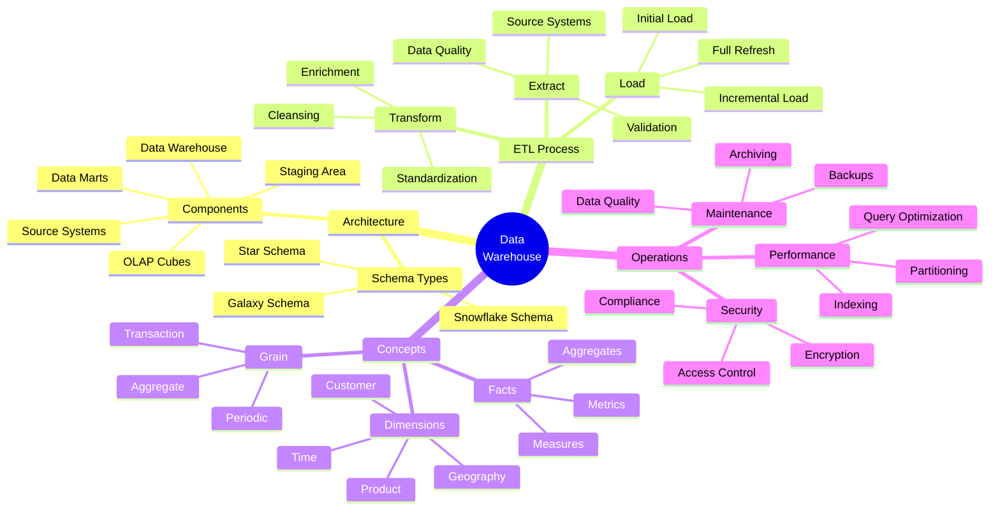
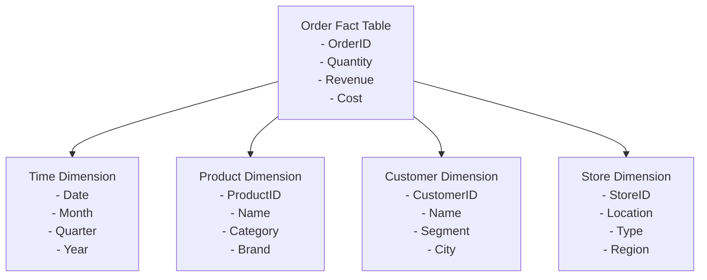
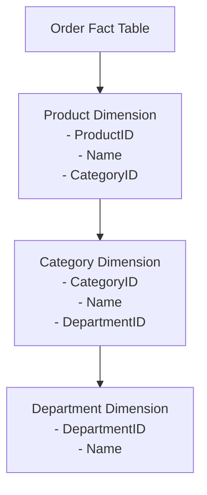
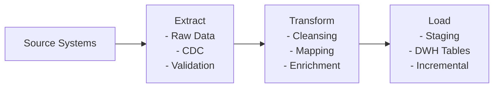

tags:

- database
- datawarehouse
- architecture
- ETL
created: 2025-02-23

---

# Data Warehouse Cheat Sheet

## 🧠 Concept Map



## 📋 Quick Reference

### Architecture Types

| Type                          | Structure                                | Pros                 | Cons                  |
| ----------------------------- | ---------------------------------------- | -------------------- | --------------------- |
| **Star Schema**               | Central fact table with dimension tables | Simple, fast queries | Redundancy            |
| **Snowflake Schema**          | Normalized dimensions                    | Less redundancy      | Complex joins         |
| **Galaxy/Fact Constellation** | Multiple fact tables                     | Flexible modeling    | Complex relationships |

### ETL Reference

| Phase | Key Activities | Tools |
|-------|---------------|-------|
| **Extract** | Source connection, validation | Informatica, Talend, Fivetran |
| **Transform** | Cleansing, standardization | dbt, Spark, Databricks |
| **Load** | Initial/incremental loading | Snowflake, Redshift, BigQuery |

### Common Dimensions

| Dimension | Examples | Purpose |
|-----------|---------|---------|
| **Time** | Year, Month, Day, Hour | Time-based analysis |
| **Product** | Category, SKU, Description | Product performance |
| **Customer** | Demographics, Segments | Customer behavior |
| **Location** | Country, Region, Store | Geographic analysis |

## 📚 Detailed Explanation

### What is a Data Warehouse?

A data warehouse is a centralized repository that stores current and historical data from multiple sources in a structured format optimized for analytical queries and business intelligence.

#### Key Characteristics

- **Subject-oriented**: Organized around major subjects like customer, product, sales
- **Integrated**: Consolidated from multiple sources with consistent naming and values
- **Time-variant**: Contains historical data with time identifiers
- **Non-volatile**: Data is stable, typically read-only after loading

### Schema Types Explained

#### Star Schema

The star schema consists of one central fact table surrounded by dimension tables. This denormalized model is simple and optimized for read operations.

```
         ┌──────────┐
         │ Time Dim │
         └────┬─────┘
              │
┌──────────┐  │  ┌──────────┐
│ Prod Dim ├──┼──┤ Fact     │
└──────────┘  │  │ Table    │
              │  └──┬───────┘
┌──────────┐  │     │
│ Cust Dim ├──┘     │
└──────────┘        │
              ┌─────┴────┐
              │ Loc Dim  │
              └──────────┘
```

#### Snowflake Schema

The snowflake schema normalizes dimension tables further, creating a structure where dimensions connect to other dimensions.

#### Galaxy Schema

Multiple fact tables share dimension tables, allowing for complex business scenarios and relationships.

### ETL Process Deep Dive

#### Extraction

- **Methods**: Full extraction, incremental extraction, log-based CDC
- **Challenges**: Source system load, data volume, integrity checks

#### Transformation

- **Data Cleansing**: Handling missing values, correcting errors
- **Data Standardization**: Unifying formats, measurements, codes
- **Business Rules**: Applying calculations, derivations, aggregations

#### Loading

- **Initial Load**: First population of the warehouse
- **Incremental Load**: Regular updates with new data
- **Refresh Strategy**: Full vs. delta vs. change data capture

### Dimensional Modeling

#### Facts

Facts are quantitative measurements of business processes. They typically contain:

- Foreign keys to dimension tables
- Numeric measures (quantity, amount, count)
- Additive, semi-additive, or non-additive properties

#### Dimensions

Dimensions provide context to the facts and support filtering, grouping, and labeling.

#### Slowly Changing Dimensions (SCDs)

- **Type 1**: Overwrite the old value
- **Type 2**: Create a new record with effective dates
- **Type 3**: Keep limited history with previous value column
- **Type 4**: Use history tables for complete tracking
- **Type 6**: Hybrid approach (1+2+3)

### Best Practices

1. **Design Phase**
   - Understand business requirements before modeling
   - Design for performance and flexibility
   - Document metadata thoroughly

2. **Implementation**
   - Use surrogate keys instead of operational keys
   - Implement appropriate SCD types
   - Balance normalization vs. denormalization

3. **Operations**
   - Monitor ETL process performance
   - Implement data quality checks
   - Establish governance procedures

## 🎯 Real Business Case Examples

### E-Commerce Data Warehouse Example

#### 1. Star Schema Implementation

Using Order Analysis as an example:



#### 2. Snowflake Schema Example

Product dimension normalization:



#### 3. OLAP Implementation

Dimension hierarchies:

- Product hierarchy: SKU -> Category -> Department
- Time hierarchy: Day -> Month -> Quarter -> Year
- Geography hierarchy: Store -> City -> Region -> Country

Common analysis:

```sql
-- Sales analysis by quarter and product category
SELECT 
    t.Quarter,
    p.Category,
    SUM(f.Revenue) as TotalRevenue,
    COUNT(DISTINCT f.OrderID) as OrderCount
FROM OrderFact f
JOIN TimeDim t ON f.TimeKey = t.TimeKey
JOIN ProductDim p ON f.ProductKey = p.ProductKey
GROUP BY t.Quarter, p.Category
ORDER BY t.Quarter, TotalRevenue DESC
```

#### 4. ETL Process Example



Typical use cases:

- Data Integration: Merging data from multiple source systems (CRM, ERP, etc.)
- Data Quality: Standardizing formats, handling missing values, deduplication
- Data Transformation: Currency conversion, unit standardization, calculations
- Incremental Loading: Efficient delta updates with change data capture

These practical examples demonstrate how these concepts are applied in real business scenarios, making it easier to understand their practical implementation and benefits.
