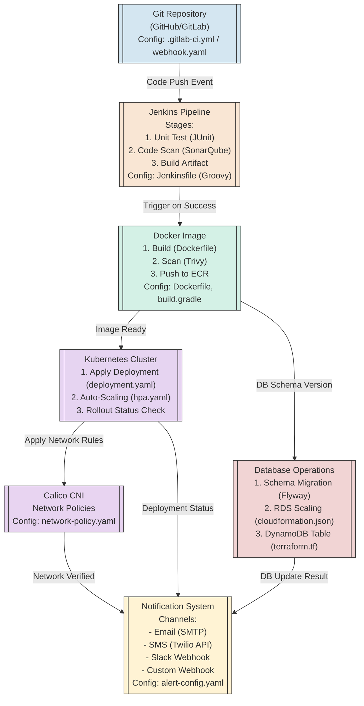

```mermaid
graph TD
    classDef git fill:#d4e6f1,stroke:#333;
    classDef ciCd fill:#f9e6d4,stroke:#333;
    classDef docker fill:#d4f1e6,stroke:#333;
    classDef k8s fill:#e6d4f1,stroke:#333;
    classDef network fill:#e8d4f1,stroke:#333;
    classDef db fill:#f1d4d4,stroke:#333;
    classDef notification fill:#fff3d4,stroke:#333;

    A[["Git Repository<br>(GitHub/GitLab)<br>Config: .gitlab-ci.yml / webhook.yaml"]]
    B[["Jenkins Pipeline<br>Stages:<br>1. Unit Test (JUnit)<br>2. Code Scan (SonarQube)<br>3. Build Artifact<br>Config: Jenkinsfile (Groovy)"]]
    C[["Docker Image<br>1. Build (Dockerfile)<br>2. Scan (Trivy)<br>3. Push to ECR<br>Config: Dockerfile, build.gradle"]]
    D[["Kubernetes Cluster<br>1. Apply Deployment (deployment.yaml)<br>2. Auto-Scaling (hpa.yaml)<br>3. Rollout Status Check"]]
    E[["Calico CNI<br>Network Policies<br>Config: network-policy.yaml"]]
    F[["Database Operations<br>1. Schema Migration (Flyway)<br>2. RDS Scaling (cloudformation.json)<br>3. DynamoDB Table (terraform.tf)"]]
    G[["Notification System<br>Channels:<br>- Email (SMTP)<br>- SMS (Twilio API)<br>- Slack Webhook<br>- Custom Webhook<br>Config: alert-config.yaml"]]

    A -->|"Code Push Event"| B
    B -->|"Trigger on Success"| C
    C -->|"Image Ready"| D
    C -->|"DB Schema Version"| F
    D -->|"Apply Network Rules"| E
    D -->|"Deployment Status"| G
    F -->|"DB Update Result"| G
    E -->|"Network Verified"| G

    class A git;
    class B ciCd;
    class C docker;
    class D k8s;
    class E network;
    class F db;
    class G notification;
```