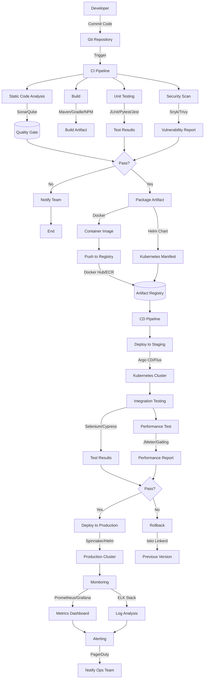
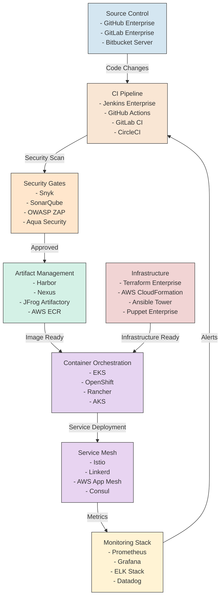

# Enterprise DevOps Workflow Overview

```mermaid
graph TD
    A[Developer] -->|Commit Code| B[Git Repository]
    B -->|Trigger| C[CI Pipeline]
    C --> C1[Static Code Analysis]
    C1 -->|SonarQube| C1a[(Quality Gate)]
    C --> C2[Build]
    C2 -->|Maven/Gradle/NPM| C2a[Build Artifact]
    C --> C3[Unit Testing]
    C3 -->|JUnit/Pytest/Jest| C3a[Test Results]
    C --> C4[Security Scan]
    C4 -->|Snyk/Trivy| C4a[Vulnerability Report]
    
    C1a --> D{Pass?}
    C3a --> D
    C4a --> D
    
    D -->|Yes| E[Package Artifact]
    D -->|No| N[Notify Team]
    N --> Z[End]
    
    E -->|Docker| E1[Container Image]
    E -->|Helm Chart| E2[Kubernetes Manifest]
    
    E1 --> F[Push to Registry]
    F -->|Docker Hub/ECR| F1[(Artifact Registry)]
    
    E2 --> F1
    
    F1 --> G[CD Pipeline]
    G --> G1[Deploy to Staging]
    G1 -->|Argo CD/Flux| G1a[Kubernetes Cluster]
    
    G1a --> H[Integration Testing]
    H -->|Selenium/Cypress| H1[Test Results]
    H --> I[Performance Test]
    I -->|JMeter/Gatling| I1[Performance Report]
    
    H1 --> J{Pass?}
    I1 --> J
    
    J -->|Yes| K[Deploy to Production]
    J -->|No| M[Rollback]
    
    K -->|Spinnaker/Helm| K1[Production Cluster]
    M -->|Istio Linkerd| M1[Previous Version]
    
    K1 --> L[Monitoring]
    L -->|Prometheus/Grafana| L1[Metrics Dashboard]
    L -->|ELK Stack| L2[Log Analysis]
    
    L1 --> O[Alerting]
    L2 --> O
    O -->|PagerDuty| P[Notify Ops Team]
```

```mermaid
graph TD
    classDef vcs fill:#d4e6f1,stroke:#333;
    classDef cicd fill:#f9e6d4,stroke:#333;
    classDef security fill:#ffe6cc,stroke:#333;
    classDef container fill:#d4f1e6,stroke:#333;
    classDef orchestration fill:#e6d4f1,stroke:#333;
    classDef network fill:#e8d4f1,stroke:#333;
    classDef infra fill:#f1d4d4,stroke:#333;
    classDef monitor fill:#fff3d4,stroke:#333;

    A[Source Control
      - GitHub Enterprise
      - GitLab Enterprise
      - Bitbucket Server]
    
    B[CI Pipeline
      - Jenkins Enterprise
      - GitHub Actions
      - GitLab CI
      - CircleCI]
    
    C[Security Gates
      - Snyk
      - SonarQube
      - OWASP ZAP
      - Aqua Security]
    
    D[Artifact Management
      - Harbor
      - Nexus
      - JFrog Artifactory
      - AWS ECR]
    
    E[Infrastructure
      - Terraform Enterprise
      - AWS CloudFormation
      - Ansible Tower
      - Puppet Enterprise]
    
    F[Container Orchestration
      - EKS
      - OpenShift
      - Rancher
      - AKS]
    
    G[Service Mesh
      - Istio
      - Linkerd
      - AWS App Mesh
      - Consul]
    
    H[Monitoring Stack
      - Prometheus
      - Grafana
      - ELK Stack
      - Datadog]

    A -->|Code Changes| B
    B -->|Security Scan| C
    C -->|Approved| D
    D -->|Image Ready| F
    E -->|Infrastructure Ready| F
    F -->|Service Deployment| G
    G -->|Metrics| H
    H -->|Alerts| B

    class A vcs;
    class B cicd;
    class C security;
    class D container;
    class E infra;
    class F orchestration;
    class G network;
    class H monitor;
```

