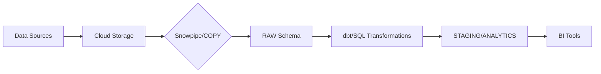

---
tags:
  - snowflake
  - ETL
  - data-engineering
  - data-warehouse
created: 2025-02-23
---

# Snowflake ETL Guide

## 📋 Overview

This guide provides a comprehensive approach to building ETL (Extract, Transform, Load) pipelines using Snowflake, including best practices, tools, and optimizations.



## 🛠️ Tools Summary

| Category | Tools |
|----------|-------|
| **Orchestration** | Apache Airflow, Prefect, Dagster |
| **Transformation** | dbt, Snowpark, Spark |
| **Ingestion** | Snowpipe, Fivetran, AWS Glue |
| **Monitoring** | Snowflake Query History, Datadog, Elasticsearch |

## 1. Planning & Requirements

### Define Objectives

- **Data Sources**: Databases, APIs, CSV/JSON files, cloud storage (S3, GCS, Azure)
- **Destination**: Snowflake tables, schemas, and warehouses (RAW, STAGING, ANALYTICS)
- **Use Case**: Business reporting, machine learning, real-time analytics

### Tools & Architecture

- **Snowflake-native**:
  - Snowpipe (continuous ingestion)
  - COPY INTO (bulk load)
- **Third-party**:
  - dbt (SQL transformations)
  - Apache Airflow (orchestration)
  - AWS Glue, Fivetran, Matillion
- **Data Formats**: CSV, JSON, Parquet, Avro

## 2. Data Extraction

### From Sources

#### Databases (PostgreSQL, MySQL)

- Use JDBC/ODBC connectors or tools like Airbyte/Stitch

```sql
-- Example SQL extraction
SELECT * FROM orders WHERE updated_at > '2023-01-01';
```

#### Cloud Storage (S3, GCS, Azure Blob)

- Sync files to Snowflake using COPY INTO or Snowpipe

#### APIs

- Scripts (Python/Node.js) to pull data → Save to cloud storage → Load to Snowflake

### Snowflake Ingestion Methods

#### Bulk Load

```sql
-- Bulk loading with COPY INTO
COPY INTO raw_schema.orders
FROM @s3_stage/orders/
FILE_FORMAT = (TYPE = CSV SKIP_HEADER = 1);
```

#### Snowpipe (Auto-Ingest)

```sql
-- Continuous ingestion with Snowpipe
CREATE PIPE orders_pipe
AUTO_INGEST = TRUE
AS
COPY INTO raw_schema.orders
FROM @s3_stage/orders/;
```

## 3. Data Transformation

### In Snowflake (ELT Approach)

#### Stage Raw Data

- Load raw data into RAW schema

#### Transform with SQL

- Use dbt for modular, version-controlled SQL transformations

```sql
-- dbt model: stg_orders.sql
WITH raw_orders AS (
  SELECT 
    order_id,
    customer_id,
    amount,
    TRY_TO_DATE(order_date) AS order_date -- Handle invalid dates
  FROM raw_schema.orders
)
SELECT * FROM raw_orders;
```

#### Advanced Transformations

- Use Snowflake UDFs (Python/JavaScript) or Snowpark for complex logic

### External Transformation (ETL Approach)

- Tools like AWS Glue or Spark to process data before loading into Snowflake

## 4. Loading into Target Tables

### Load to Structured Tables

```sql
INSERT INTO analytics_schema.orders_fact
SELECT 
  order_id,
  customer_id,
  SUM(amount) AS total_amount
FROM staging_schema.orders
GROUP BY 1, 2;
```

### Incremental Loads

```sql
MERGE INTO analytics_schema.customers AS target
USING staging_schema.customers_updates AS source
ON target.customer_id = source.customer_id
WHEN MATCHED THEN UPDATE SET target.email = source.email
WHEN NOT MATCHED THEN INSERT (customer_id, email) VALUES (source.customer_id, source.email);
```

## 5. Post-Load Validation & Monitoring

### Data Quality Checks

- Validate row counts, NULL values, and duplicates

```sql
-- Example: Check for NULL customer IDs
SELECT COUNT(*) FROM analytics_schema.orders_fact WHERE customer_id IS NULL;
```

### Performance Monitoring

- Use Snowflake's QUERY_HISTORY view to track long-running queries
- Optimize warehouse size (X-Small to 4X-Large) and enable auto-suspend

## 6. Automation & Orchestration

### Workflow Orchestration

- Apache Airflow: Schedule and monitor ETL jobs

```python
# Airflow DAG example
with DAG('snowflake_etl', schedule_interval='@daily') as dag:
    load_task = SnowflakeOperator(
        task_id='load_data',
        sql='COPY_INTO_SCRIPT.sql',
        snowflake_conn_id='snowflake_default'
    )
```

### Cost Optimization

- Use auto-suspend for warehouses
- Monitor storage costs with STORAGE_USAGE view

## 7. Optimization & Scaling

### Performance Tuning

- Clustering Keys: Improve query speed on large tables

```sql
CREATE TABLE orders_fact (...) CLUSTER BY (order_date);
```

- Materialized Views: Precompute aggregations

### Data Sharing

- Securely share datasets across teams/partners with Snowflake Data Sharing

## 8. Security & Governance

### Access Control

- Use RBAC roles (e.g., ETL_DEV, ANALYST)
- Grant least privilege access:

```sql
GRANT USAGE ON SCHEMA raw_schema TO ROLE ETL_DEV;
```

### Encryption

- Enable TLS for data in transit
- Use Snowflake's built-in encryption for data at rest

## 9. Documentation & Maintenance

- **Data Lineage**: Track with dbt docs or AWS Glue Data Catalog
- **Version Control**: Store SQL scripts, dbt models, and Airflow DAGs in Git
- **Cost Audits**: Use Snowflake's ACCOUNT_USAGE schema to analyze spending

## 📚 Best Practices

1. Use Snowflake Time Travel to recover accidental deletions
2. Test transformations with zero-copy cloning
3. Avoid SELECT * in transformations to reduce costs
4. Partition large tables by date/region
5. Use appropriate warehouse sizes for different workloads
6. Implement proper error handling in all ETL steps
7. Monitor query performance and optimize regularly
