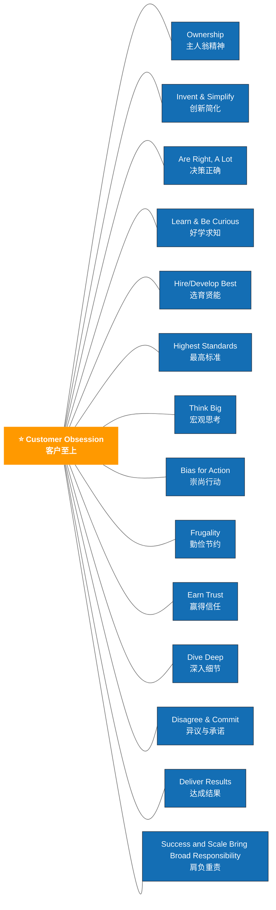

![[Drawing 2025-03-30 09.06.15.excalidraw|1518]]

## Customer Obsession

Leaders start with the customer and work backwards. They work vigorously to earn and keep customer trust. Although leaders pay attention to competitors, they obsess over customers.

## Ownership

Leaders are owners. They think long term and don't sacrifice long-term value for short-term results. They act on behalf of the entire company, beyond just their own team. They never say "that's not my job."

## Invent and Simplify

Leaders expect and require innovation and invention from their teams and always find ways to simplify. They are externally aware, look for new ideas from everywhere, and are not limited by "not invented here." As we do new things, we accept that we may be misunderstood for long periods of time.

## Are Right, A Lot

Leaders are right a lot. They have strong judgment and good instincts. They seek diverse perspectives and work to disconfirm their beliefs.

## Learn and Be Curious

Leaders are never done learning and always seek to improve themselves. They are curious about new possibilities and act to explore them.

## Hire and Develop the Best

Leaders raise the performance bar with every hire and promotion. They recognize exceptional talent, and willingly move them throughout the organization. Leaders develop leaders and take seriously their role in coaching others. We work on behalf of our people to invent mechanisms for development like Career Choice.

## Insist on the Highest Standards

Leaders have relentlessly high standards — many people may think these standards are unreasonably high. Leaders are continually raising the bar and drive their teams to deliver high quality products, services, and processes. Leaders ensure that defects do not get sent down the line and that problems are fixed so they stay fixed.

## Think Big

Thinking small is a self-fulfilling prophecy. Leaders create and communicate a bold direction that inspires results. They think differently and look around corners for ways to serve customers.

## Bias for Action

Speed matters in business. Many decisions and actions are reversible and do not need extensive study. We value calculated risk taking.

## Frugality

Accomplish more with less. Constraints breed resourcefulness, self-sufficiency, and invention. There are no extra points for growing headcount, budget size, or fixed expense.

## Earn Trust

Leaders listen attentively, speak candidly, and treat others respectfully. They are vocally self-critical, even when doing so is awkward or embarrassing. Leaders do not believe their or their team's body odor smells of perfume. They benchmark themselves and their teams against the best.

## Dive Deep

Leaders operate at all levels, stay connected to the details, audit frequently, and are skeptical when metrics and anecdote differ. No task is beneath them.

## Have Backbone; Disagree and Commit

Leaders are obligated to respectfully challenge decisions when they disagree, even when doing so is uncomfortable or exhausting. Leaders have conviction and are tenacious. They do not compromise for the sake of social cohesion. Once a decision is determined, they commit wholly.

## Deliver Results

Leaders focus on the key inputs for their business and deliver them with the right quality and in a timely fashion. Despite setbacks, they rise to the occasion and never settle.

## Strive to be Earth's Best Employer

Leaders work every day to create a safer, more productive, higher performing, more diverse, and more just work environment. They lead with empathy, have fun at work, and make it easy for others to have fun. Leaders ask themselves: Are my fellow employees growing? Are they empowered? Are they ready for what's next? Leaders have a vision for and commitment to their employees' personal success, whether that be at Amazon or elsewhere.

## Success and Scale Bring Broad Responsibility

We started in a garage, but we're not there anymore. We are big, we impact the world, and we are far from perfect. We must be humble and thoughtful about even the secondary effects of our actions. Our local communities, planet, and future generations need us to be better every day. We must begin each day with a determination to make better, do better, and be better for our customers, our employees, our partners, and the world at large. And we must end every day knowing we can do even more tomorrow. Leaders create more than they consume and always leave things better than how they found them.
