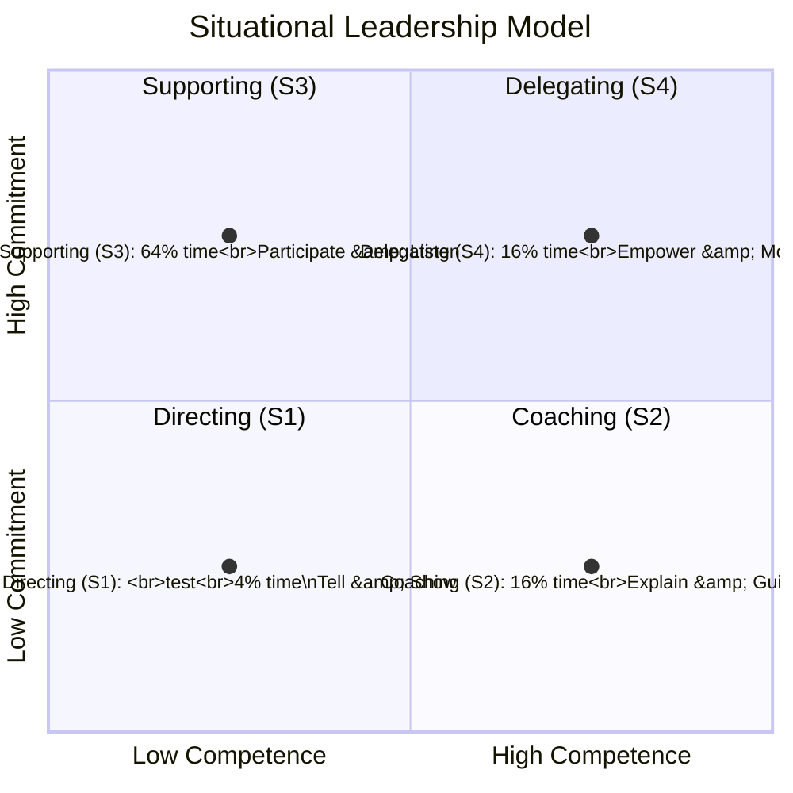

# Situational Leadership Model (Readiness Levels)

## Leadership Quadrant Chart

## Leadership Styles Based on Readiness

| Readiness Level | Leadership Style | Communication Approach | Decision Making | Development Focus |
|----------------|------------------|----------------------|-----------------|------------------|
| R1: Low will, Low ability | Directing (S1) | Clear instructions, specific guidance | Manager makes decisions | Task-specific training, establish basics |
| R2: High will, Low ability | Coaching (S2) | Explain decisions, provide opportunity for questions | Manager makes decisions with employee input | Skill building, knowledge transfer |
| R3: Low will, High ability | Supporting (S3) | Listen to concerns, facilitate problem-solving | Employee makes decisions with manager support | Confidence building, increase motivation |
| R4: High will, High ability | Delegating (S4) | Minimal supervision, regular updates | Employee makes decisions | Autonomy, strategic involvement |

## Practical Application Guide

### How to Lead R1 Employees (Directing)

- Provide clear, specific instructions
- Set short-term, achievable goals
- Monitor performance closely
- Give immediate feedback
- Focus on "what," "how," and "when"

**Example:** "I need you to complete these 5 specific tasks by Friday. Let's check in daily to review progress."

### How to Lead R2 Employees (Coaching and Resourcing)

- Explain the "why" behind tasks
- Provide guidance but encourage input
- Recognize enthusiasm and effort
- Develop skills through training
- Balance direction with dialogue

**Example:** "Let me show you how to approach this project. What questions do you have about the process?"

### How to Lead R3 Employees (Supporting and building trust)

- Focus on rebuilding motivation
- Listen to concerns and frustrations
- Involve them in decision-making
- Acknowledge their expertise
- Provide minimal task direction

**Example:** "You have excellent skills in this area. What do you think would be the best approach to solve this problem?"

### How to Lead R4 Employees (Delegating and supporting)

- Assign responsibility for entire projects
- Reduce direct supervision
- Involve in strategic planning
- Provide resources, remove obstacles
- Focus on results, not methods

**Example:** "This project is yours to lead. Let me know what resources you need and if any obstacles arise."

## Readiness Level Transitions

### Key Transition Points

- Moving from R1 to R2: Focus on small wins to build confidence while providing training
- Moving from R2 to R4: Gradually reduce supervision as competence grows
- Moving from R3 to R4: Address motivation issues through involvement and recognition
- Regression to lower levels: Can occur during organizational change or new responsibilities

## Common Mistakes to Avoid

1. Over-directing R4 employees (micromanaging)
2. Under-directing R1 employees (assuming capability)
3. Failing to adjust style as readiness changes
4. Using the same leadership style for all team members
5. Neglecting the psychological aspects of readiness

---
Note: To view the chart properly, ensure you have the Mermaid plugin enabled in Obsidian.
