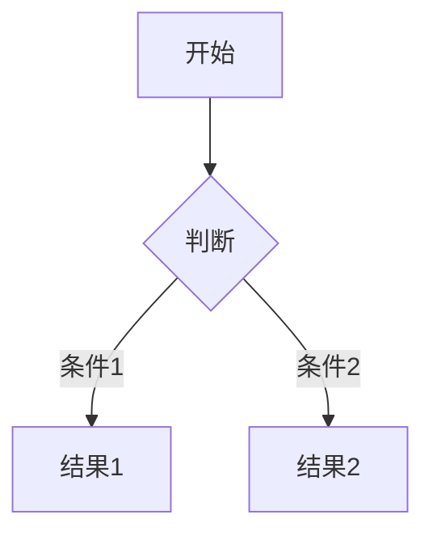

# Markdown 学习笔记

## 基础语法速查

| 功能 | 语法 | 效果 |
|------|------|------|
| **标题** | `# H1` ~ `###### H6` | 分级标题 |
| **加粗** | `**加粗**` 或 `__加粗__` | **加粗** |
| **斜体** | `*斜体*` 或 `_斜体_` | *斜体* |
| **删除线** | `~~删除线~~` | ~~删除线~~ |
| **代码行内** | `` `code` `` | `行内代码` |
| **代码块** | ````语言\n代码\n```` | 语法高亮 |
| **链接** | `[显示文字](URL)` | [Obsidian](https://obsidian.md) |
| **图片** | `` | 图片显示 |
| **无序列表** | `- 项目` 或 `* 项目` | • 项目 |
| **有序列表** | `1. 项目` | 1. 项目 |
| **任务列表** | `- [ ] 任务` | □ 任务 |
| **引用块** | `> 引用内容` | > 引用内容 |
| **水平线** | `---` 或 `***` | 分割线 |

## Obsidian 增强语法

### 1. 双向链接语法

```markdown
[[笔记名]]                # 基础链接
[[笔记名#标题]]           # 链接到特定章节
[[笔记名|显示别名]]       # 自定义显示文字
![[笔记名]]              # 嵌入整个笔记
```

### 2. Callout 提示块

```markdown
> [!NOTE] 
> 这是一个普通提示

> [!WARNING]- 折叠警告
> 这是一个可折叠的警告提示
```

### 3. 表格增强

```markdown
| 左对齐 | 居中对齐 | 右对齐 |
|:-------|:--------:|-------:|
| 文本   | 文本     | 数字   |
```

### 4. 高级功能

#### Dataview 查询

```dataview
TABLE file.mtime AS "修改时间"
FROM "文件夹"
SORT file.mtime DESC
LIMIT 5
```

#### Mermaid 图表



## 排版技巧

- 强制换行：行尾添加两个空格  
- 缩进代码：每行前加 4 个空格
- 文字颜色：`<span style="color:red">红字</span>`
- 文本对齐：`<center>居中文字</center>`

## 推荐插件

- Advanced Tables：表格增强
- Templater：模板系统
- QuickAdd：快速捕获
- Dataview：数据查询

## 注意事项

1. 保持格式简洁
2. 善用空行分隔内容
3. 适当使用标题层级
4. 使用适量的装饰语法
