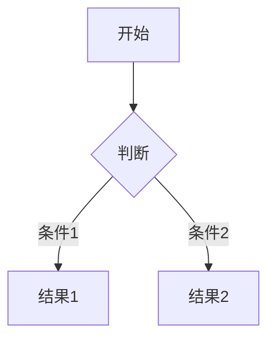
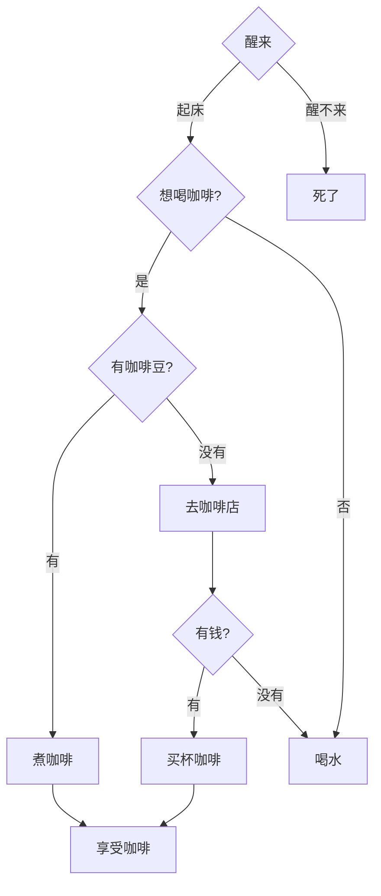

# Markdown 学习笔记

## 基础语法速查

| 功能 | 语法 | 效果 |
|------|------|------|
| **标题** | `# H1` ~ `###### H6` | 分级标题 |
| **加粗** | `**加粗**` 或 `__加粗__` | **加粗** |
| **斜体** | `*斜体*` 或 `_斜体_` | *斜体* |
| **删除线** | `~~删除线~~` | ~~删除线~~ |
| **代码行内** | `` `code` `` | `行内代码` |
| **代码块** | ````语言\n代码\n```` | 语法高亮 |
| **链接** | `[显示文字](URL)` | [Obsidian](https://obsidian.md) |
| **图片** | `` | 图片显示 |
| **无序列表** | `- 项目` 或 `* 项目` | • 项目 |
| **有序列表** | `1. 项目` | 1. 项目 |
| **任务列表** | `- [ ] 任务` | □ 任务 |
| **引用块** | `> 引用内容` | > 引用内容 |
| **水平线** | `---` 或 `***` | 分割线 |

## Obsidian 增强语法

### 1. 双向链接语法

```markdown
[[笔记名]]                # 基础链接
[[笔记名#标题]]           # 链接到特定章节
[[笔记名|显示别名]]       # 自定义显示文字
![[笔记名]]              # 嵌入整个笔记
```

### 2. Callout 提示块

```markdown
> [!NOTE] 
> 这是一个普通提示

> [!WARNING]- 折叠警告
> 这是一个可折叠的警告提示
```

### 3. 表格增强

```markdown
| 左对齐 | 居中对齐 | 右对齐 |
|:-------|:--------:|-------:|
| 文本   | 文本     | 数字   |
```

### 4. 高级功能

#### Dataview 查询

```dataview
TABLE file.mtime AS "修改时间"
FROM "文件夹"
SORT file.mtime DESC
LIMIT 5
```

#### Mermaid 图表



## 排版技巧

- 强制换行：行尾添加两个空格  
- 缩进代码：每行前加 4 个空格
- 文字颜色：`<span style="color:red">红字</span>`
- 文本对齐：`<center>居中文字</center>`

## 推荐插件

- Advanced Tables：表格增强
- Templater：模板系统
- QuickAdd：快速捕获
- Dataview：数据查询

## 注意事项

1. 保持格式简洁
2. 善用空行分隔内容
3. 适当使用标题层级
4. 使用适量的装饰语法

---

# Markdown Exercise

## 练习题

1. **Callout实战**：创建一个折叠的警告提示框，内容为"请注意备份数据"

2. **表格排版**：创建一个三列表格，展示你最喜欢的三本书，包含书名(左对齐)、作者(居中)、评分(右对齐)

3. **双向链接**：创建一个指向"项目计划"笔记的特定章节"进度"的链接，并设置显示文字为"查看最新进度"

4. **Mermaid图表**：画一个简单的流程图，展示"早上喝咖啡的决策过程"

5. **混合格式**：写一段文字，同时运用加粗、斜体、删除线三种格式

6. **高级列表**：创建一个包含子任务的任务清单

7. **数据视图**：写一个查询，显示最近修改的3个笔记的标题和修改时间

8. **排版技巧**：写一段红色的居中文字，内容为"重要提醒"

## 你的答案：

>[!WARNING]+ 警告
>请注意备份数据!!

> [!note]- 折叠信息
> 这是一个可折叠的信息提示

| Name | Author | Rate |
|:------|:------:|------:|
|My Love|**Jackie Yan**   |   8.8   |
| 深入理解<br>计算机系统 | Patterson | 9.8 |
| 代码整洁之道 | Robert C. Martin | 9.5 |
| 设计模式 | `GoF`四人组 | 9.3 |


[[Learning Plan#Markdown|MARKDOWN]]





写一段文字,需要用到**加粗加粗**,还要用到*斜体字* ***斜体加粗***
~~最后这段写的不好我打算删除~~
<span style="color:red">
这段文字我打算用红色标注,因为他太重要了,但是没次也这段太费劲,我需要问问ai,有没有更好的办法
</span>

<span style="color:red">红字</span>

这是我的任务清单,看看都完成了些什么
- [X] 起床
- [x] 吃饭
	- [X] 吃包子
	- [ ] 吃饺子
	- [ ] 吃雪糕
- [x] 上厕所
- [ ] 睡觉


## 我感觉我写的还不错!!!##

`还是应该一边学markdown 一边学习mermaid`