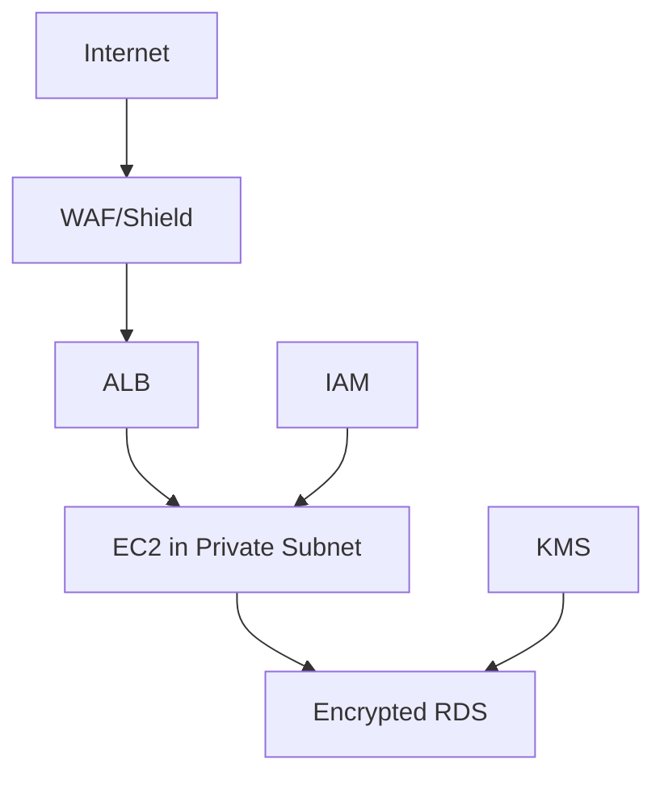

# AWS Security Quick Reference 🔐

## Core Security Services Overview 📋

| Service     | Purpose                      | Key Features                      |
| ----------- | ---------------------------- | --------------------------------- |
| IAM         | Identity & Access Management | Users, Roles, Policies            |
| KMS         | Key Management               | Encryption key storage & rotation |
| WAF         | Web Application Firewall     | HTTP/HTTPS filtering              |
| Shield      | DDoS Protection              | Network/transport layer defense   |
| GuardDuty   | Threat Detection             | powered security monitoring       |
| SecurityHub | Security Posture             | Centralized security view         |
| Macie       | Data Security                | Sensitive data discovery          |
| Inspector   | Vulnerability Assessment     | Automated security assessment     |

## Detailed Service Explanations 🔍

### Identity Services

#### IAM (Identity & Access Management) 👤

- **Purpose**: Manage access to AWS services
- **Features**:
  - Users, Groups, Roles
  - Policy management
  - MFA support
  - Access key management
  - STS (Security Token Service)
- **Common Uses**:
  - Service account creation
  - Cross-account access
  - Temporary security credentials (STS tokens)
    - AssumeRole
    - GetSessionToken
    - AssumeRoleWithWebIdentity
    - AssumeRoleWithSAML

#### STS (Security Token Service) 🎟️

- **Purpose**: Issue temporary security credentials
- **Features**:
  - Short-lived credentials (15min - 36hr)
  - Auto-rotation
  - Cross-account delegation
- **Common Uses**:
  - Federation (SAML, OIDC)
  - Role assumption
  - Cross-account access
  - EC2 instance profiles

#### Cognito 🌐

- **Purpose**: User authentication for apps
- **Features**:
  - User pools
  - Identity pools
  - Social identity federation
- **Common Uses**:
  - Mobile app auth
  - Web app user management
  - OAuth/OIDC integration

### Data Protection

#### KMS (Key Management Service) 🔑

- **Purpose**: Encryption key management
- **Features**:
  - Key rotation
  - Key policies
  - Audit logging
- **Common Uses**:
  - S3 encryption
  - EBS volume encryption
  - RDS encryption

#### Macie 🔎

- **Purpose**: Data discovery & protection
- **Features**:
  - PII detection
  - Data classification
  - S3 bucket analysis
- **Common Uses**:
  - Compliance monitoring
  - Data privacy
  - Security assessment

### Network Security

#### WAF (Web Application Firewall) 🛡️

- **Purpose**: Web traffic filtering
- **Features**:
  - Rule sets
  - IP blocking
  - Rate limiting
- **Common Uses**:
  - SQL injection prevention
  - XSS protection
  - Geo-blocking

#### Shield 🛡️

- **Purpose**: DDoS protection
- **Features**:
  - Always-on detection
  - Advanced protection
  - Cost protection
- **Common Uses**:
  - Layer 3/4 protection
  - Application protection
  - AWS resource protection

## Security Best Practices ⭐

### IAM Best Practices

1. **Principle of Least Privilege**
   - Use specific permissions
   - Regular access review
   - Remove unused credentials

2. **Root Account Security**
   - Enable MFA
   - Avoid daily use
   - Delete root access keys

3. **Password Policy**
   - Complex passwords
   - Regular rotation
   - MFA enforcement

### Data Protection

1. **Encryption**
   - Enable at rest
   - Enable in transit
   - Use KMS managed keys

2. **Access Logging**
   - Enable CloudTrail
   - Enable S3 access logs
   - Monitor API calls

3. **Backup Strategy**
   - Regular backups
   - Encrypted backups
   - Cross-region copies

### Network Security

1. **VPC Security**
   - Use security groups
   - Implement NACLs
   - Private subnets

2. **Monitoring**
   - Enable GuardDuty
   - Configure CloudWatch
   - Set up alerts

## Common Security Architectures 🏗️

## Quick Security Checklist ✅

- [ ] IAM password policy configured
- [ ] Root MFA enabled
- [ ] CloudTrail enabled in all regions
- [ ] GuardDuty enabled
- [ ] S3 bucket policies reviewed
- [ ] Security groups audited
- [ ] Encryption enabled for sensitive data
- [ ] Regular security assessment scheduled

For detailed examples, see [[AWS Security Examples]]
