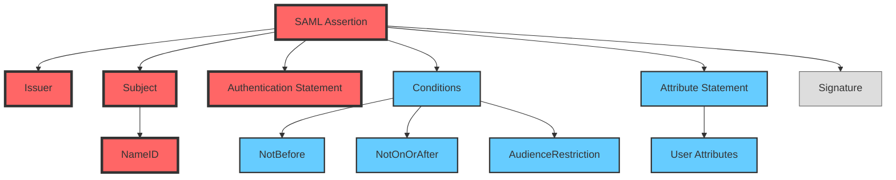

# SAML Assertion

SAML Assertion 是 SAML 协议中的核心组件，它包含了关于用户身份和属性的声明信息。由 Identity Provider (IdP) 生成并签名，用于向 Service Provider (SP) 证明用户的身份和授权信息。

## Assertion Structure



## 关键组件说明

### 核心元素（红色标记）

- **Assertion本身**: 
  - Version: SAML版本（如2.0）
  - ID: 唯一标识符
  - IssueInstant: 生成时间戳

- **Issuer**: 
  - IdP的唯一标识符
  - 通常是URL格式
  - 例如: `https://idp.example.com`

- **Subject**: 
  - NameID: 用户的唯一标识
  - SubjectConfirmation: 确认方法
  - 可以是email、持久ID等

- **Authentication Statement**:
  - AuthnInstant: 认证时间
  - SessionIndex: 会话标识
  - AuthnContext: 认证上下文

### 重要细节（蓝色标记）

- **Conditions**:
  - NotBefore: 生效时间
  - NotOnOrAfter: 过期时间
  - AudienceRestriction: 指定允许处理此断言的SP

- **Attribute Statement**:
  - 用户属性信息
  - 如：邮箱、角色、权限等
  - 格式：名称-值对

### 安全信息（灰色标记）

- **Signature**:
  - 数字签名确保完整性
  - 包含签名算法
  - 签名值
  - 证书信息

## SAML Assertion 示例

```xml
<saml:Assertion
    xmlns:saml="urn:oasis:names:tc:SAML:2.0:assertion"
    Version="2.0"
    ID="_93af655219464fb403b34436cfb0c5cb1d9a5502"
    IssueInstant="2025-03-06T18:43:21Z">
    
    <saml:Issuer>https://idp.example.com</saml:Issuer>
    
    <ds:Signature xmlns:ds="http://www.w3.org/2000/09/xmldsig#">
        <!-- 签名信息 -->
    </ds:Signature>

    <saml:Subject>
        <saml:NameID Format="urn:oasis:names:tc:SAML:1.1:nameid-format:emailAddress">
            user@example.com
        </saml:NameID>
        <saml:SubjectConfirmation Method="urn:oasis:names:tc:SAML:2.0:cm:bearer">
            <saml:SubjectConfirmationData 
                NotOnOrAfter="2025-03-06T18:48:21Z"
                Recipient="https://sp.example.com/acs"/>
        </saml:SubjectConfirmation>
    </saml:Subject>

    <saml:Conditions 
        NotBefore="2025-03-06T18:43:21Z"
        NotOnOrAfter="2025-03-06T18:48:21Z">
        <saml:AudienceRestriction>
            <saml:Audience>https://sp.example.com</saml:Audience>
        </saml:AudienceRestriction>
    </saml:Conditions>

    <saml:AuthnStatement 
        AuthnInstant="2025-03-06T18:43:21Z"
        SessionIndex="_be9967abd904ddcae3c0eb4189adbe3f71e327cf93">
        <saml:AuthnContext>
            <saml:AuthnContextClassRef>
                urn:oasis:names:tc:SAML:2.0:ac:classes:PasswordProtectedTransport
            </saml:AuthnContextClassRef>
        </saml:AuthnContext>
    </saml:AuthnStatement>

    <saml:AttributeStatement>
        <saml:Attribute Name="FirstName">
            <saml:AttributeValue>John</saml:AttributeValue>
        </saml:Attribute>
        <saml:Attribute Name="LastName">
            <saml:AttributeValue>Doe</saml:AttributeValue>
        </saml:Attribute>
        <saml:Attribute Name="Role">
            <saml:AttributeValue>Admin</saml:AttributeValue>
        </saml:Attribute>
    </saml:AttributeStatement>
</saml:Assertion>
```

## 安全考虑

1. **签名验证**:
   - 必须验证Assertion的签名
   - 确保使用信任的证书
   - 检查签名算法的安全性

2. **时间验证**:
   - 检查NotBefore和NotOnOrAfter
   - 考虑时钟偏差
   - 避免重放攻击

3. **受众限制**:
   - 验证AudienceRestriction
   - 确保匹配SP的标识符
   - 防止Assertion被转发
