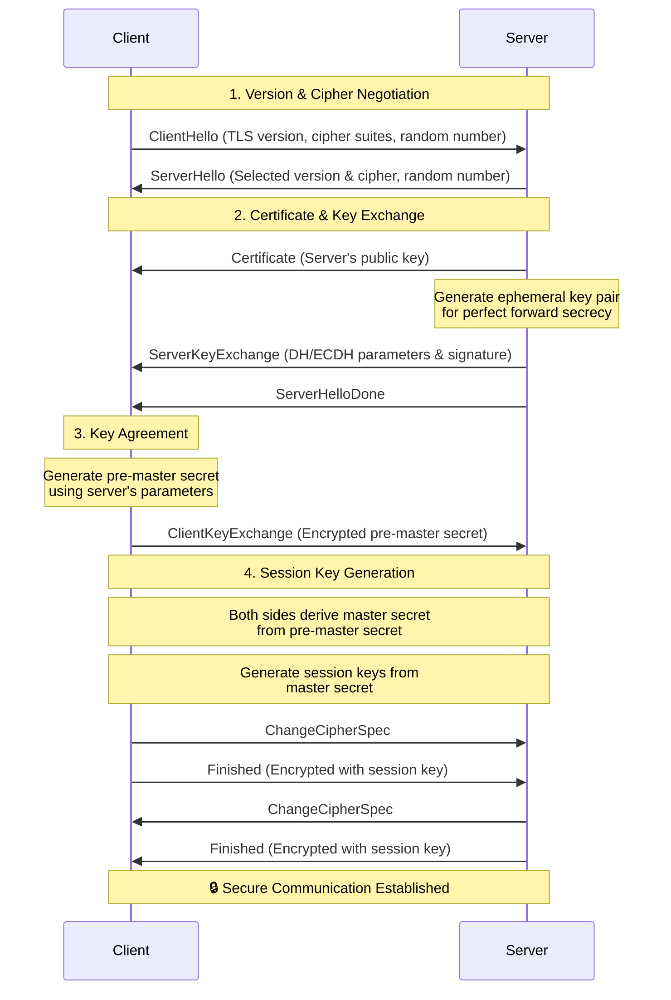

 # SSL/TLS Quick Reference 🔒

## Protocol Comparison 📋

| Version | Status | Secure | Default Port |
|---------|---------|---------|--------------|
| SSL 2.0 | ❌ Deprecated | No | 443 |
| SSL 3.0 | ❌ Deprecated | No | 443 |
| TLS 1.0 | ⚠️ Obsolete | Partial | 443 |
| TLS 1.1 | ⚠️ Obsolete | Partial | 443 |
| TLS 1.2 | ✅ Current | Yes | 443 |
| TLS 1.3 | ✅ Current | Best | 443 |

## Common Commands 🛠️

```bash
# Test SSL connection
openssl s_client -connect example.com:443 -tls1_2

# View certificate details
openssl x509 -in cert.pem -text -noout

# Test supported protocols
nmap --script ssl-enum-ciphers -p 443 example.com

# Check certificate expiry
echo | openssl s_client -servername example.com -connect example.com:443 2>/dev/null | openssl x509 -noout -dates
```

## TLS Handshake Process 🤝



### Key Exchange Explanation 🔑

1. **ServerKeyExchange:**
   - Server generates temporary DH/ECDH parameters
   - Signs parameters with private key
   - Enables Perfect Forward Secrecy (PFS)
   - Not sent if using RSA key exchange

2. **ClientKeyExchange:**
   - Client generates pre-master secret
   - For RSA: Encrypts with server's public key
   - For DH/ECDH: Sends public key component
   - Contributes to final master secret

3. **Session Keys:**
   - Both sides independently generate same keys
   - Derived from:
     - Pre-master secret
     - Client random
     - Server random

## Security Best Practices ⚡

| Category | Recommendation |
|----------|----------------|
| Protocols | ✅ TLS 1.2+ only |
| Ciphers | ✅ AES-GCM, ChaCha20 |
| Key Exchange | ✅ ECDHE, DHE |
| Certificates | ✅ RSA 2048+ or ECC |

## Common Issues & Fixes 🔧

| Issue | Check | Resolution |
|-------|-------|------------|
| Cert Error | `openssl verify` | Update chain |
| Protocol Mismatch | `openssl s_client` | Enable TLS 1.2+ |
| Cipher Mismatch | `ssl-enum-ciphers` | Update cipher suite |
| Expired Cert | `x509 -dates` | Renew certificate |

## Performance Tips 🚀

- Enable session resumption
- Use OCSP stapling
- Configure proper cipher order
- Enable HTTP/2 support

For detailed troubleshooting, see [[verify certificate]]
