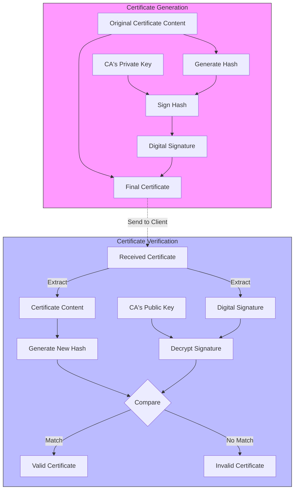

# Certificate Verification Cheat sheet 🔐

## Quick Reference Table

| Check      | Command                                                                 | Expected Result                      |
| ---------- | ----------------------------------------------------------------------- | ------------------------------------ |
| Chain      | `openssl s_client -connect <server>:443 -showcerts`                     | Unbroken chain to trusted CA         |
| Dates      | `openssl x509 -in cert.pem -noout -dates`                               | Valid date range                     |
| Domain     | `openssl x509 -in cert.pem -noout -text \| grep -E "Subject:\|DNS:"`    | Matching hostname                    |
| Signature  | `openssl verify -CAfile ca-bundle.pem cert.pem`                         | OK (0)                               |
| Revocation | `openssl ocsp -issuer int.pem -cert cert.pem -url <ocsp>`               | Response: good+                      |
| Usage      | `openssl x509 -in certificate.pem -noout -text \| grep -A1 "Key Usage"` | **Signing**<br> **Key Encipherment** |


## Certificate Validation Process 🔄



## Detailed Checks 📋

### 1. Certificate Chain Verification ⛓️

```bash
openssl s_client -connect <server>:443 -showcerts
```

- ✅ All certificates in chain must be trusted
- ✅ Chain must lead to trusted root CA
- ✅ No missing intermediate certificates

### 2. Date Validation 📅

```bash
openssl x509 -in certificate.pem -noout -dates
```

- ✅ Not Before: Check start date
- ✅ Not After: Check expiration date
- ⚠️ Consider time zone differences

### 3. Hostname Verification 🌐

```bash
openssl x509 -in certificate.pem -noout -text | grep -E "Subject:|DNS:"
```

- ✅ Check Subject Alternative Name (SAN)
- ✅ Verify Common Name (CN)
- ✅ Match against actual server hostname

### 4. Signature Validation ✍️

```bash
openssl verify -CAfile ca-bundle.pem certificate.pem
```

- ✅ Verify signature integrity
- ✅ Check against trusted CA bundle
- ❌ Watch for verification errors

### 5. Revocation Status 🚫

```bash
openssl ocsp -issuer intermediate.pem -cert certificate.pem -url http://ocsp.digicert.com
```

- ✅ Check OCSP response
- ✅ Verify against CRL if available
- ⚠️ Monitor response timeouts

### 6. Key Usage Verification 🔑

```bash
openssl x509 -in certificate.pem -noout -text | grep -A1 "Key Usage"
```

Expected values:

- Digital Signature/Signing
- Key Encipherment
- TLS Web Server Authentication

## Common Issues to Watch ⚠️

| Issue | Check | Resolution |
|-------|-------|------------|
| Expired Cert | Date validation | Renew certificate |
| Wrong Domain | Hostname check | Request new cert with correct domain |
| Broken Chain | Chain verification | Install missing intermediate certs |
| Revoked Cert | OCSP check | Request new certificate |

For detailed troubleshooting, see [[SSL-TLS-Troubleshooting]]
